# Slice 1 — BFC & requirements: physical schema spec

Author: `apple` · 2026-09-29 · branch `slice-1-bfc` · source of truth: `docs/VB_design.md`
(signed off 2026-09-28). Section numbers (§) refer to that document. This spec **does not
redesign**. Where the design is silent, ambiguous or self-contradictory, the table below shows a
**proposed** choice marked **[Q-n]**, and §4 lists each one for Ben. Nothing in §1 marked [Q-n]
should be built until Ben has answered it.

Dialect: **PostgreSQL 16**. Pattern: `backend/alembic/vb_ops.py::audit_columns()` +
`updated_at_trigger()`, `models/base.py::AuditMixin`, and raw `op.execute` for partial and
expression indexes. This is the same as migrations 0002–0003.

---

## 0. Rules that apply to every table below (stated once)

| Rule | Applies as | Source |
|---|---|---|
| **Audit columns.** `created_at`, `updated_at`, `created_by NOT NULL`, `updated_by`, `is_active DEFAULT true`, `deleted_at`, `deleted_by`, `row_version DEFAULT 1` | `*audit_columns()` in the migration, `AuditMixin` in the model (`version_id_col` → stale write = 409) | §5.1, VB law 3 |
| **Trigger** `trg_<table>_updated_at BEFORE UPDATE … fn_set_updated_at()` | `updated_at_trigger(t)` / `drop_updated_at_trigger(t)` | §5.1, §13 |
| **Surrogate PK** `bigint GENERATED BY DEFAULT AS IDENTITY` (`sa.Identity()`) | every non-junction table | §5.1 |
| **FK actions.** Every FK is `ON DELETE NO ACTION ON UPDATE NO ACTION`. Never CASCADE or SET NULL. Guard FKs write `onupdate="NO ACTION"` explicitly, as 0002/0003 do | all | §5.4.4, §5.4.7(2), §7.12 "nothing cascades" |
| **FKs to `app_user` (audit columns)** are not indexed. This matches 0002–0004, and they are excluded from `FK_LIVENESS` | all | §5.4.15 |
| **Grants.** No explicit GRANT is needed. 0001's `ALTER DEFAULT PRIVILEGES` gives `vb_app` SELECT/INSERT/UPDATE (plus USAGE on the identity sequences). **No DELETE, no TRUNCATE on any Slice-1 table.** The §6.6 CI grant test must cover them | all | §6.6, VB law 1 |
| **RLS.** None. It is deferred, and criterion 49 (route-guard test) is the price | all | §6.4 |
| **Reject trigger.** None. These are live tables, and shadows come later | — | VB law 2 |
| **Liveness** (no active child under an inactive parent) is enforced by the service through `FK_LIVENESS` / `DEPENDENTS` / `PARENTS`, not by the DB. The exception is the FKs whose target includes `is_active` | per §5.4.15 table rows for these 12 tables | §5.4.15, §7.12 |
| **`owning_project_id()`** returns `self.project_id` on every model (object_guard contract) | models | §7.8, `tenancy.py` |
| **Generated guard** `x boolean GENERATED ALWAYS AS (CASE WHEN is_active THEN <TRUE\|FALSE> END) STORED` | proposed helper `vb_ops.live_guard(name, value)` so the expression is written once | §5.4.7(1) |

Type choices where the design gives none: names `varchar(200)`, user-entered codes
`varchar(30)`, minted numbers `varchar(20)` (prefix ≤10 + `-` + digits, `numbering.py`), long
prose `text`.

---

## 1. Tables

### 1.1 `org_unit` — client organisational unit, L1–L3, within one project (§3, §5.3 ORG_UNIT)

| Column | Type | Null | Default | FK | Description |
|---|---|---|---|---|---|
| `org_unit_id` | bigint identity | NO | identity | — | PK |
| `project_id` | bigint | NO | — | → `project(project_id)` | tenancy |
| `parent_org_unit_id` | bigint | YES | — | composite, below | NULL iff L1 |
| `level_no` | smallint | NO | — | — | 1–3, set by the service from the parent's level (derived) |
| `level_code_id` | bigint | NO | — | → `code_master(code_id)` | `ORG_UNIT_LEVEL`. Named `unit_level_code` in §8; the §5.2 name is used **[Q-9]** |
| `org_unit_code` | varchar(30) | NO | — | — | user-entered **[Q-8]** |
| `org_unit_name` | varchar(200) | NO | — | — | |
| `seq_no` | int | NO | — | — | sibling order, set by the service |
| `description` | text | YES | — | — | |
| §0 audit columns | | | | | |

- PK `org_unit_id`. UK `uq_org_unit_project (org_unit_id, project_id)` is the composite-FK target. §5.3 writes it as `(project_id, org_unit_id)`, but the column order has to match the FK.
- FK `fk_org_unit_parent (parent_org_unit_id, project_id) → org_unit(org_unit_id, project_id)` (§5.3).
- CHECK `ck_org_unit_level (level_no BETWEEN 1 AND 3)`, `ck_org_unit_root ((level_no = 1) = (parent_org_unit_id IS NULL))` (§5.3).
- Partial UK `uq_org_unit_sibling_seq (project_id, parent_org_unit_id, seq_no) NULLS NOT DISTINCT WHERE is_active` (§5.1 positional rule; `project_id` + NULLS NOT DISTINCT **[Q-1]**).
- Partial UK `uq_org_unit_code_live (project_id, org_unit_code) WHERE is_active` **[Q-8]**.
- Indexes: `ix_org_unit_project (project_id)`, `ix_org_unit_parent (parent_org_unit_id, project_id)`, `ix_org_unit_level_code (level_code_id)` (§6.3 every FK).
- Depth consistency (`child.level_no = parent.level_no + 1`): service + `consistency_check` **[Q-9]**.

### 1.2 `org_role` — role within one client org unit (§5.3 ORG_ROLE). Never `role` (VB law 7)

| Column | Type | Null | Default | FK | Description |
|---|---|---|---|---|---|
| `org_role_id` | bigint identity | NO | identity | — | PK |
| `project_id` | bigint | NO | — | → `project` | |
| `org_unit_id` | bigint | NO | — | composite, below | |
| `org_role_code` | varchar(30) | NO | — | — | user-entered |
| `org_role_name` | varchar(200) | NO | — | — | |
| `responsibility_desc` | text | YES | — | — | |
| `headcount` | int | YES | — | — | |
| §0 audit | | | | | |

- UK `uq_org_role_project (org_role_id, project_id)` is the target for the RACI junctions (§6.2 "all junctions").
- FK `fk_org_role_unit (org_unit_id, project_id) → org_unit(org_unit_id, project_id)` **[Q-10]** (§5.3 lists plain FKs only; §5.6 requires composite).
- UK on the code: §5.3 says full `(project_id, org_role_code)`. Proposed: partial `uq_org_role_code_live … WHERE is_active` **[Q-8]**.
- CHECK `ck_org_role_headcount (headcount IS NULL OR headcount >= 0)` (apple addition, [Q-18]).
- Indexes: `ix_org_role_project (project_id)`, `ix_org_role_unit (org_unit_id, project_id)`.

### 1.3 `data_entity` — logical data entity in one project (§5.3 DATA_ENTITY)

| Column | Type | Null | Default | FK | Description |
|---|---|---|---|---|---|
| `data_entity_id` | bigint identity | NO | identity | — | PK |
| `project_id` | bigint | NO | — | → `project` | |
| `de_number` | varchar(20) | NO | — | — | `DE-0001`, **minted by `next_number(…,'DE')` at save. Never read from the request body** (VB law 6, §5.4.6) |
| `de_name` | varchar(200) | NO | — | — | |
| `description` | text | YES | — | — | |
| `business_owner_note` | text | YES | — | — | |
| §0 audit | | | | | |

- UK `uq_de_number (project_id, de_number)`, full, so a number is never reused (§5.1, §5.4.6, §6.2).
- UK `uq_data_entity_project (data_entity_id, project_id)` is the composite target (§6.2 D9).
- Partial UK `uq_de_name_live (project_id, lower(btrim(de_name))) WHERE is_active` **[Q-6]**. The design says "probably — confirm".
- Index `ix_data_entity_project (project_id)` is served by `uq_de_number` (it leads with `project_id`). No separate index is needed.

### 1.4 `data_field` — logical field in one DE (§5.3 DATA_FIELD, D-26, §5.4.17)

| Column | Type | Null | Default | FK | Description |
|---|---|---|---|---|---|
| `data_field_id` | bigint identity | NO | identity | — | PK |
| `project_id` | bigint | NO | — | → `project` | finding D9 |
| `data_entity_id` | bigint | NO | — | composite, below | owner |
| `seq_no` | int | NO | — | — | display order, set by the service |
| `field_name` | varchar(200) | NO | — | — | |
| `data_type_code_id` | bigint | YES | — | → `code_master` | `FIELD_DATA_TYPE`; optional (D-26) |
| `length_val` | int | YES | — | — | |
| `precision_val` | int | YES | — | — | |
| `scale_val` | int | YES | — | — | |
| `is_mandatory` | boolean | YES | — | — | TRUE / FALSE / NULL = unknown (A-53) |
| `is_primary_key` | boolean | NO | false | — | |
| `pk_ordinal` | smallint | YES | — | — | |
| `is_foreign_key` | boolean | NO | false | — | |
| `ref_data_entity_id` | bigint | YES | — | composite, below | parent DE. §4.2/§7.4 call it `fk_target_entity_id`; the §5.2 name is used |
| `ref_data_field_id` | bigint | YES | — | composite, below | parent field |
| `fk_group_no` | smallint | YES | — | — | the relationship within `(data_entity_id, ref_data_entity_id)` **[Q-13]** |
| `description` | text | YES | — | — | |
| §0 audit | | | | | |

- UK `uq_data_field_entity (data_field_id, data_entity_id)` is the target for the ref-field FK (§5.3).
- FKs: `fk_df_entity (data_entity_id, project_id) → data_entity(data_entity_id, project_id)`; `fk_df_ref_entity (ref_data_entity_id, project_id) → data_entity(data_entity_id, project_id)`; `fk_df_ref_field (ref_data_field_id, ref_data_entity_id) → data_field(data_field_id, data_entity_id)`. The last two together prove the ref field is in the ref DE and the ref DE is in this project (§5.3, §6.2 D9). A self-reference (a manager FK pointing at its own entity) is legal.
- CHECKs (§5.3, and §6.2 rows 17/28/32–34). The biconditional forms from §5.3 are used; §6.2 rows 32–33 list only one direction, and the biconditional implies it:
  - `ck_df_pk_ordinal (is_primary_key = (pk_ordinal IS NOT NULL))`
  - `ck_df_fk_target (is_foreign_key = (ref_data_entity_id IS NOT NULL))`
  - `ck_df_ref_field (ref_data_field_id IS NULL OR is_foreign_key)`
  - `ck_df_fk_group ((fk_group_no IS NOT NULL) = is_foreign_key)`, `ck_df_fk_group_pos (fk_group_no IS NULL OR fk_group_no >= 1)`
  - `ck_df_pk_not_optional (NOT is_primary_key OR is_mandatory IS DISTINCT FROM FALSE)`
  - `ck_df_size_needs_type (data_type_code_id IS NOT NULL OR num_nulls(length_val, precision_val, scale_val) = 3)`
  - apple additions [Q-18]: `ck_df_pk_ordinal_pos (pk_ordinal IS NULL OR pk_ordinal >= 1)`, `ck_df_sizes (coalesce(length_val,1) > 0 AND coalesce(precision_val,1) > 0 AND coalesce(scale_val,0) >= 0 AND (scale_val IS NULL OR precision_val IS NULL OR scale_val <= precision_val))`
- Unique:
  - `uq_df_name_live (data_entity_id, lower(btrim(field_name))) WHERE is_active` **[Q-7]**. The design writes it as a full `UNIQUE (data_entity_id, field_name)` in §5.3/§6.2, but §7.4 says "among active fields".
  - `uq_df_pk_ordinal (data_entity_id, pk_ordinal) WHERE is_primary_key AND is_active` (§5.3; `AND is_active` **[Q-7]**)
  - `uq_df_fk_group_field (data_entity_id, ref_data_entity_id, fk_group_no, ref_data_field_id) WHERE is_active AND ref_data_field_id IS NOT NULL` (§5.3, §6.2)
  - `uq_df_seq_live (data_entity_id, seq_no) WHERE is_active` (§5.1 positional; field reorder must be two-phase, like BFC, [Q-2])
- Indexes: `ix_df_entity (data_entity_id, project_id)`, `ix_df_ref_entity (ref_data_entity_id, project_id)`, `ix_df_ref_field (ref_data_field_id)`, `ix_df_type (data_type_code_id)`, `ix_df_fk_group (data_entity_id, ref_data_entity_id, fk_group_no) WHERE is_foreign_key` (§6.3).

### 1.5 `external_entity` — party outside the client that exchanges data (§5.3 EXTERNAL_ENTITY, D-24a)

| Column | Type | Null | Default | FK | Description |
|---|---|---|---|---|---|
| `external_entity_id` | bigint identity | NO | identity | — | PK |
| `project_id` | bigint | NO | — | → `project` | |
| `ext_number` | varchar(20) | NO | — | — | `EXT-0001`, minted (`'EXT'` series) and never taken from the body |
| `ext_name` | varchar(200) | NO | — | — | |
| `kind_code_id` | bigint | YES | — | → `code_master` | `EXTERNAL_ENTITY_KIND`. An unknown kind is a warning (§5.3) |
| `description` | text | YES | — | — | |
| §0 audit | | | | | |

- UK `uq_ext_number (project_id, ext_number)`, full; UK `uq_external_entity_project (external_entity_id, project_id)`; partial UK `uq_ext_name_live (project_id, lower(ext_name)) WHERE is_active` (§5.3, §6.2).
- Index `ix_ext_kind (kind_code_id)`. The project FK is served by `uq_ext_number`.

### 1.6 `bfc_node` — node of the business function chart, L1–L5 (§5.3 BFC_NODE, D-23, §5.4.7)

| Column | Type | Null | Default | FK | Description |
|---|---|---|---|---|---|
| `bfc_node_id` | bigint identity | NO | identity | — | PK |
| `project_id` | bigint | NO | — | → `project` | |
| `parent_bfc_node_id` | bigint | YES | — | two composites, below | NULL iff L1 |
| `parent_is_process` | boolean | YES | **GENERATED `CASE WHEN is_active THEN FALSE END` STORED** | guard, below | D-23 parent guard |
| `level_no` | smallint | NO | — | — | depth, **derived by the service** |
| `is_process` | boolean | NO | false | — | D-23. **The only process test anywhere** (VB law 4) |
| `seq_no` | int | NO | — | — | sibling order, derived by the service **[Q-3]** |
| `hier_code` | varchar(40) | NO | — | — | `01.02.03`, **computed at save** (§4.1). `varchar(40)` leaves room for the reorder temp code **[Q-2]** |
| `node_name` | varchar(200) | NO | — | — | |
| `purpose_desc` | text | YES | — | — | |
| `data_processing_desc` | text | YES | — | — | process only |
| §0 audit | | | | | |

- UKs (FK targets, §5.3/§6.2): `uq_bfc_node_project (bfc_node_id, project_id)`, `uq_bfc_node_process_target (bfc_node_id, project_id, is_process)`.
- FKs: `fk_bfc_node_parent (parent_bfc_node_id, project_id) → bfc_node(bfc_node_id, project_id)` for existence and tenancy on every row; `fk_bfc_node_parent_not_process (parent_bfc_node_id, project_id, parent_is_process) → bfc_node(bfc_node_id, project_id, is_process) ON UPDATE NO ACTION` (never CASCADE: §5.4.7(2)).
- CHECKs (§5.3, §6.2): `ck_bfc_level (level_no BETWEEN 1 AND 5)`, `ck_bfc_root ((level_no = 1) = (parent_bfc_node_id IS NULL))`, `ck_bfc_process_level (NOT is_process OR level_no >= 3)`, `ck_bfc_l5_is_process (level_no < 5 OR is_process)`, `ck_bfc_desc_process_only (is_process OR data_processing_desc IS NULL)`. Proposed [Q-3]: `ck_bfc_seq (seq_no <> 0 AND seq_no BETWEEN -99 AND 99)`. The range tolerates the reorder's negative phase (§7.2).
- Unique:
  - `uq_bfc_hier_code_live (project_id, hier_code) WHERE is_active` (R2-D10)
  - `uq_bfc_sibling_seq (project_id, parent_bfc_node_id, seq_no) NULLS NOT DISTINCT WHERE is_active`. §5.3 has `(parent_bfc_node_id, seq_no)`, which does not protect L1 **[Q-1]**
  - `uq_bfc_process_name (parent_bfc_node_id, lower(btrim(node_name))) WHERE is_active AND is_process` (Q1). A parent is always non-null here, because processes are L3+.
- Indexes (§6.3): `ix_bfc_parent_guard (parent_bfc_node_id, project_id, parent_is_process)` serves both parent FKs and tree expansion; `ix_bfc_hier_pattern (project_id, hier_code varchar_pattern_ops) WHERE is_active`; `ix_bfc_process_live (project_id) WHERE is_process AND is_active`; `ix_bfc_project (project_id)`. The §6.3 `(parent_bfc_node_id, seq_no)` lookup is served by `ix_bfc_parent_guard` plus `uq_bfc_sibling_seq`.

### 1.7 `business_requirement` — exactly one per active process node (§3, §5.3, D-2/D-23, §5.4.1a)

| Column | Type | Null | Default | FK | Description |
|---|---|---|---|---|---|
| `br_id` | bigint identity | NO | identity | — | PK |
| `project_id` | bigint | NO | — | → `project` | |
| `bfc_node_id` | bigint | NO | — | two composites, below | **immutable** (service; DB once CRUD exists) [Q-14] |
| `node_is_process` | boolean | YES | **GENERATED `CASE WHEN is_active THEN TRUE END` STORED** | guard | |
| `br_number` | varchar(20) | NO | — | — | `BR-0001`, minted in `create_br`. It is the step's import identity (R2-D1) |
| `br_statement` | text | **YES** | — | — | NULL at auto-creation **[Q-11]** |
| `business_logic` | text | YES | — | — | |
| `output_expectation` | text | YES | — | — | |
| `status_code_id` | bigint | NO | — | → `code_master` | `BR_STATUS`. The service sets the project-resolved `DRAFT` **[Q-11]** |
| §0 audit | | | | | |

- UKs: `uq_br_number (project_id, br_number)`, full; `uq_br_project (br_id, project_id)` is the target for `br_org_role` (and later `issue_br` / `br_solution`); `uq_br_node_carrier (br_id, project_id, bfc_node_id)` is the D-24 carrier for `br_data_entity` (§5.3, §6.2).
- Partial UK `uq_br_one_per_node (bfc_node_id) WHERE is_active`. This is D-2, and dropping it is the whole cost of reversing D-2 (§5.4.1a, §6.2).
- FKs: `fk_br_node (bfc_node_id, project_id) → bfc_node(bfc_node_id, project_id)`; `fk_br_node_process (bfc_node_id, project_id, node_is_process) → bfc_node(bfc_node_id, project_id, is_process) ON UPDATE NO ACTION`.
- Indexes: `ix_br_node (bfc_node_id, project_id)` (§6.3 guard index), `ix_br_status (status_code_id)`. `(project_id, br_number)` is the UK.

### 1.8 `bfc_node_data_entity` — step I/O, the one record of it (§5.3, D-24, §5.4.2)

| Column | Type | Null | Default | FK | Description |
|---|---|---|---|---|---|
| `bfc_node_id` | bigint | NO | — | composites | PK part |
| `data_entity_id` | bigint | NO | — | composite | PK part |
| `direction` | char(1) | NO | — | — | PK part; `I` / `O`, from the step's point of view |
| `project_id` | bigint | NO | — | → `project` | |
| `node_is_process` | boolean | YES | GENERATED `CASE WHEN is_active THEN TRUE END` | guard | |
| `note` | text | YES | — | — | |
| *(proposed)* `bfc_node_data_entity_id` | bigint identity | NO | identity | — | **UNIQUE**, stable shadow `source_id` **[Q-12]** |
| §0 audit | | | | | |

- PK `(bfc_node_id, data_entity_id, direction)`. CHECK `ck_bnde_direction (direction IN ('I','O'))`.
- UK `uq_bnde_live_target (bfc_node_id, data_entity_id, direction, is_active)` is the D-24 licence target. `is_active` is in it so that a retire counts as a key change (§5.3, §5.4.2).
- FKs: `fk_bnde_node (bfc_node_id, project_id) → bfc_node`; `fk_bnde_node_process (bfc_node_id, project_id, node_is_process) → bfc_node(…, is_process) ON UPDATE NO ACTION`; `fk_bnde_de (data_entity_id, project_id) → data_entity(data_entity_id, project_id)`.
- Indexes: `ix_bnde_node (bfc_node_id, project_id)`, `ix_bnde_de (data_entity_id, project_id)`, `ix_bnde_project (project_id)`.
- Writer: only `bfc.ensure_step_io` (R2-D13). A re-link restores the retired PK row; it never inserts a new one (§7.3, §7.12).

### 1.9 `br_data_entity` — BR × DE × CRUD, licensed by step I/O (§5.3, §5.4.2, D-24)

| Column | Type | Null | Default | FK | Description |
|---|---|---|---|---|---|
| `br_id` | bigint | NO | — | composite | PK part |
| `data_entity_id` | bigint | NO | — | composite | PK part |
| `crud_code` | char(1) | NO | — | — | PK part; a CHECK, not code_master (§8 deviation) |
| `direction` | char(1) | NO* | **GENERATED `CASE WHEN crud_code = 'R' THEN 'I' ELSE 'O' END` STORED** | licence | *never NULL, because crud_code is NOT NULL |
| `project_id` | bigint | NO | — | → `project` | |
| `bfc_node_id` | bigint | NO | — | carrier | copy of the BR's node. **The service writes it from the BR, never from the body** |
| `io_is_active` | boolean | YES | GENERATED `CASE WHEN is_active THEN TRUE END` | licence | |
| `usage_note` | text | YES | — | — | |
| *(proposed)* `br_data_entity_id` | bigint identity | NO | identity | — | UNIQUE [Q-12] |
| §0 audit | | | | | |

- PK `(br_id, data_entity_id, crud_code)`. CHECK `ck_brde_crud (crud_code IN ('C','R','U','D'))`.
- FKs: `fk_brde_br (br_id, project_id, bfc_node_id) → business_requirement(br_id, project_id, bfc_node_id)`; `fk_brde_de (data_entity_id, project_id) → data_entity`; **`fk_brde_io_licence (bfc_node_id, data_entity_id, direction, io_is_active) → bfc_node_data_entity(bfc_node_id, data_entity_id, direction, is_active) ON UPDATE NO ACTION`** (D-24).
- Indexes (§6.3): `ix_brde_de (data_entity_id)`, `ix_brde_io (bfc_node_id, data_entity_id, direction)`, `ix_brde_project (project_id)`. The BR FK is served by the PK, which leads with `br_id`.

### 1.10 `bfc_node_org_role` — step × org role × RACI code (§5.3, §5.4.5, Q7)

| Column | Type | Null | Default | FK | Description |
|---|---|---|---|---|---|
| `bfc_node_id` | bigint | NO | — | composites | PK part |
| `org_role_id` | bigint | NO | — | composite | PK part |
| `raci_code_id` | bigint | NO | — | behaviour FK | PK part |
| `project_id` | bigint | NO | — | → `project` | |
| `node_is_process` | boolean | YES | GENERATED (TRUE if active) | guard | |
| `raci_category` | varchar(40) | NO* | **GENERATED `'RACI_TYPE'` STORED** | behaviour FK | §5.3 says varchar(20); 40 matches `code_master.category` |
| `raci_behaviour` | varchar(20) | NO | — | behaviour FK | **copied by the service from the code, never from the body** |
| *(proposed)* `bfc_node_org_role_id` | bigint identity | NO | identity | — | UNIQUE [Q-12] |
| §0 audit | | | | | |

- PK `(bfc_node_id, org_role_id, raci_code_id)`.
- FKs: `fk_bnor_node (bfc_node_id, project_id)`; `fk_bnor_node_process (bfc_node_id, project_id, node_is_process) → bfc_node(…, is_process) ON UPDATE NO ACTION`; `fk_bnor_role (org_role_id, project_id) → org_role(org_role_id, project_id)`; **`fk_bnor_raci (raci_code_id, raci_category, raci_behaviour) → code_master(code_id, category, behaviour_code) ON UPDATE NO ACTION`**. The target is the existing `uq_code_behaviour_target`, and this FK is what makes a behaviour immutable once referenced (§5.4.13).
- Partial UKs: `uq_bnor_one_accountable (bfc_node_id) WHERE is_active AND raci_behaviour = 'ACCOUNTABLE'`; `uq_bnor_one_responsible (bfc_node_id) WHERE is_active AND raci_behaviour = 'RESPONSIBLE'`. The second is also the lane lookup (§5.3, §6.2, §6.3, A-46).
- Indexes: `ix_bnor_node (bfc_node_id, project_id)`, `ix_bnor_role (org_role_id, project_id)`, `ix_bnor_raci (raci_code_id)`, `ix_bnor_project (project_id)`.

### 1.11 `br_org_role` — BR × org role × RACI code (§5.3, §5.4.5)

| Column | Type | Null | Default | FK | Description |
|---|---|---|---|---|---|
| `br_id` | bigint | NO | — | composite | PK part |
| `org_role_id` | bigint | NO | — | composite | PK part |
| `raci_code_id` | bigint | NO | — | behaviour FK | PK part |
| `project_id` | bigint | NO | — | → `project` | |
| `raci_category` | varchar(40) | NO* | GENERATED `'RACI_TYPE'` | behaviour FK | |
| `raci_behaviour` | varchar(20) | NO | — | behaviour FK | service copy |
| *(proposed)* `br_org_role_id` | bigint identity | NO | identity | — | UNIQUE [Q-12] |
| §0 audit | | | | | |

- PK `(br_id, org_role_id, raci_code_id)`. FKs: `fk_bror_br (br_id, project_id) → business_requirement(br_id, project_id)`; `fk_bror_role (org_role_id, project_id) → org_role`; `fk_bror_raci (raci_code_id, raci_category, raci_behaviour) → code_master(code_id, category, behaviour_code) ON UPDATE NO ACTION`.
- Partial UK `uq_bror_one_accountable (br_id) WHERE is_active AND raci_behaviour = 'ACCOUNTABLE'` (§5.3, §6.2). There is no process guard: the BR carries it. There is no Responsible rule on the BR, per the design.
- Indexes: `ix_bror_role (org_role_id, project_id)`, `ix_bror_raci (raci_code_id)`, `ix_bror_project (project_id)`. The BR FK is served by the PK.

### 1.12 `bfc_node_external_flow` — step × party × direction × DE (nullable) (§5.3, D-24a, §5.4.9)

| Column | Type | Null | Default | FK | Description |
|---|---|---|---|---|---|
| `bfc_node_external_flow_id` | bigint identity | NO | identity | — | PK (surrogate, because the DE is nullable) |
| `project_id` | bigint | NO | — | → `project` | |
| `bfc_node_id` | bigint | NO | — | composites | process step |
| `node_is_process` | boolean | YES | GENERATED (TRUE if active) | guard | |
| `external_entity_id` | bigint | NO | — | composite | |
| `direction` | char(1) | NO | — | — | `I` = party→step, `O` = step→party |
| `data_entity_id` | bigint | YES | — | composite + licence | NULL = data not modelled yet |
| `io_is_active` | boolean | YES | GENERATED (TRUE if active) | licence | |
| `flow_label` | varchar(200) | YES | — | — | |
| `note` | text | YES | — | — | |
| §0 audit | | | | | |

- UK constraint `uq_bnef_grain UNIQUE NULLS NOT DISTINCT (bfc_node_id, external_entity_id, direction, data_entity_id)`, **full**: re-adding restores the row (§5.3). CHECK `ck_bnef_direction (direction IN ('I','O'))`.
- FKs: `fk_bnef_node (bfc_node_id, project_id)`; `fk_bnef_node_process (bfc_node_id, project_id, node_is_process) → bfc_node(…, is_process) ON UPDATE NO ACTION`; `fk_bnef_ext (external_entity_id, project_id) → external_entity(external_entity_id, project_id)`; `fk_bnef_de (data_entity_id, project_id) → data_entity`; **`fk_bnef_io_licence (bfc_node_id, data_entity_id, direction, io_is_active) → bfc_node_data_entity(…, is_active) ON UPDATE NO ACTION`**. MATCH SIMPLE skips it when the DE is NULL (§5.3).
- Indexes (§6.3): `ix_bnef_io (bfc_node_id, data_entity_id, direction)`, `ix_bnef_ext (external_entity_id)`, `ix_bnef_node (bfc_node_id, project_id)`, `ix_bnef_de (data_entity_id, project_id)`, `ix_bnef_project (project_id)`.

---

## 2. Which link tables are in Slice 1

| Table | In? | Reason from the design |
|---|---|---|
| `bfc_node_data_entity` | **Yes** | It is the licence target of `br_data_entity` (§5.4.2), so the BR's DE grid cannot exist without it. It is "the one record of a step's I/O" (§3, D-24). `ensure_step_io` is its only writer (§7.3) |
| `br_data_entity` | **Yes** | The BR is the hub, and its DE/CRUD grid is the product's core (§5.6). `link_br_data_entity` is in §4.3 |
| `bfc_node_org_role` | **Yes** | `link_bfc_role` is in the §4.1 BFC grid. The step's RACI is a `mark_process` demotion blocker (§7.2) and the lane (A-46) |
| `br_org_role` | **Yes** | `link_br_role` is in §4.3. Every BR is meant to end up with an Accountable (§5.4.5). All its parents are in the slice |
| `bfc_node_external_flow` | **Yes** | `link_bfc_external_flow` is in the **§4.1** BFC grid, not §4.1a. `ensure_step_io` / `unlink_data_entity` must check external dependents (§7.3, R2-D13), so building the helper once, complete, avoids rework. Without it, `external_entity` has no use |
| `bfc_node_flow` | **No: defer to the process-flow slice** | It is §4.1a (D-20), read only by `generate_process_flow` and the flow JSON import. Its `flow_type` shape is an open decision (Q-5). The D-23 guard arrives with the table, so deferring it loses no integrity. When it lands, `mark_process(demote)` adds flow edges to its blocker list |

---

## 3. Migration plan (one migration per commit, reversible, on `main`, in order)

Each migration creates one table, its constraints, its raw `CREATE [UNIQUE] INDEX … WHERE …`
statements and its `updated_at` trigger. `downgrade()` drops the trigger, then the table (the
indexes go with it). **Any downgrade of a populated table is destructive, so pause for Ben.**

| Rev | Creates | Depends on (FK targets) |
|---|---|---|
| 0005 | `org_unit` | project, code_master, self |
| 0006 | `org_role` | org_unit |
| 0007 | `data_entity` | project |
| 0008 | `data_field` | data_entity, code_master, self |
| 0009 | `external_entity` | project, code_master |
| 0010 | `bfc_node` | project, self |
| 0011 | `business_requirement` | bfc_node, code_master |
| 0012 | `bfc_node_data_entity` | bfc_node, data_entity |
| 0013 | `br_data_entity` | business_requirement, data_entity, bfc_node_data_entity |
| 0014 | `bfc_node_org_role` | bfc_node, org_role, code_master (`uq_code_behaviour_target`) |
| 0015 | `br_org_role` | business_requirement, org_role, code_master |
| 0016 | `bfc_node_external_flow` | bfc_node, external_entity, data_entity, bfc_node_data_entity |

Per commit, also:
- Add the model to `models/__init__.py` (VB law 10). Proposed modules are `models/client_org.py` (OrgUnit, OrgRole), `models/data_model.py` (DataEntity, DataField), `models/bfc.py` (BfcNode, BfcNodeDataEntity, BfcNodeOrgRole, ExternalEntity, BfcNodeExternalFlow) and `models/requirement.py` (BusinessRequirement, BrDataEntity, BrOrgRole). Composite-FK relationships are `viewonly=True`, as `Project.program` is.
- Add a `vb_ops.live_guard(name, value)` helper in 0005 (and a `const_column` helper for `raci_category`), so the guard expression is written once.
- Extend the §6.6 grant test and the §5.4.15 `FK_LIVENESS` coverage test to the new tables.

---

## 4. Rule checks

| Rule | Status in this spec |
|---|---|
| **`is_process`, never `level_no = 5`** (VB law 4, D-23) | ✓ Every process rule is `is_process` or a `*_is_process` guard. `level_no` appears only in the depth CHECKs `BETWEEN 1 AND 5`, `>= 3` and `< 5` (§5.3). None is the banned literal. The service must use `level == 5` only as the A-54 default in `create_node`, as §7.2 does, and never as a process test |
| **No bare `role`** (VB law 7) | ✓ `org_role`, `org_role_id`, `org_role_code`, `bfc_node_org_role`, `br_org_role`. Constraint prefixes use `bnor` / `bror` |
| **Behaviour, not code, for RACI** (VB law 5, Q7) | ✓ The single-Accountable and single-Responsible rules key on `raci_behaviour`, which is FK-verified against `(code_id, category, behaviour_code)`. No constraint names a letter. ✗ **Open:** `bfc_node_flow` would branch on the code `'CONDITIONAL'` (§7.2a) unless Q-5 is taken, but that table is deferred |
| **Derived values never client-supplied** (VB law 6) | DB-derived (cannot be supplied): `parent_is_process`, `node_is_process`, `io_is_active`, `direction` (on `br_data_entity`), `raci_category`, `updated_at`, `row_version`. Service-derived (Pydantic request schemas must **omit** them): `de_number`, `br_number`, `ext_number` (next_number), `created_by` / `updated_by` / `deleted_by` (JWT), `level_no`, `seq_no`, `hier_code`, `is_process` at L5, `br_data_entity.bfc_node_id`, `raci_behaviour`, `project_id` (route context). `fk_group_no`: see Q-13 |
| **`project_id` on every table** | ✓ All 12 tables |
| **Composite FKs stop cross-project links** (§5.6, §6.2, D9) | ✓ Every intra-scope FK is `(x_id, project_id)`, including `org_role → org_unit` (Q-10) and the data_field ref FKs. **Gap:** the `code_master` FKs cannot be project-proven, because a project override row has a *different* `project_id` and a global row has NULL, so a code from project B's override is storable on a project A row. See Q-4 |

**Live columns the baseline shadows will need** (`services/baseline_shadow.py`, a later slice):
1. **Composite-PK tables have no single `source_id`.** `baseline_shadow.shadow_table` stores `source_id` as "the live PK value" and **drops every PK column** from the snapshot. For `bfc_node_data_entity`, `br_data_entity`, `bfc_node_org_role` and `br_org_role` that would lose the link itself. The fix has to be born with the table: add the proposed surrogate `*_id` identity UNIQUE (the precedent is `effort_rate.effort_rate_id`, "stable source pointer", §5.2). The generator also needs changing so it drops only that surrogate. See Q-12.
2. The generated columns (`*_is_process`, `io_is_active`, `raci_category`, `br_data_entity.direction`) are excluded by the generator (`c.computed`). That is correct, but §5.2's `BASELINE_BR_DATA_ENTITY.direction` will not appear. It is derivable from `crud_code`.
3. The generator will snapshot every non-audit column. §5.2's shadow blocks omit `bfc_node.purpose_desc`, `business_requirement.output_expectation` and `data_entity.business_owner_note`. The parity test will include them, so Ben should confirm they are hashed.
4. The shadows need a code **and** a label for `status_code_id`, `level_code_id`, `kind_code_id`, `data_type_code_id` and `raci_code_id` (plus `raci_behaviour`, which is hashed, §6.1), and baseline-id remapping of the parent/ref FKs (§5.2 `baseline_parent_node_id`). The generator does neither yet.

---

## 5. Open questions for Ben (recommendation first)

None of these is destructive: every Slice-1 migration only creates tables. The one destructive
act in scope is a `downgrade` on populated data.

1. **Sibling `seq_no` uniqueness misses L1 (defect).** §5.3/§6.2 `UNIQUE (parent_bfc_node_id, seq_no) WHERE is_active`. L1 parents are NULL, NULLs are distinct, so two L1 nodes can share seq 1, and every project's roots share one "parent". **Rec:** `(project_id, parent_bfc_node_id, seq_no) NULLS NOT DISTINCT WHERE is_active`, and the same shape for `org_unit`.
2. **Reorder collides on `hier_code` (defect in §7.2).** The two-phase fix solves `seq_no` only. Recomputing `hier_code` row by row still hits `uq_bfc_hier_code_live` on any swap, because a non-deferrable unique index is checked per row and a partial index cannot be deferred. §7.2 also recomputes only `{node} ∪ descendants`, but every shifted sibling's subtree changes too. **Rec:** in `renumber_subtree`, phase 1 sets `hier_code = '~' || bfc_node_id` on every affected row (it cannot equal a dotted code, and it is why the column is varchar(40)); phase 2 writes the final codes. The same two-phase approach applies to `data_field.seq_no` if field reorder exists.
3. **`seq_no` range.** Codes are zero-padded to two digits (§4.1), so the 100th sibling breaks the fixed-width sort. A `seq_no >= 1` CHECK would break the negative reorder phase. **Rec:** `CHECK (seq_no <> 0 AND seq_no BETWEEN -99 AND 99)`, which gives at most 99 siblings. The alternative is a 3-digit pad everywhere.
4. **Code FKs are not category- or project-verified.** Only RACI and FR type get the `(code_id, category, …)` FK. `status_code_id`, `level_code_id`, `kind_code_id` and `data_type_code_id` could point at any category, and at another project's override. `uq_code_category_target (code_id, category)` already exists in 0002 with no referencer. **Rec:** add a generated constant `*_category` column plus an FK to `uq_code_category_target` on each code FK in this slice (additive, same pattern as RACI). Enforce project scope in `code_master.resolve`/`validate_required_code` only, plus a `consistency_check.code_out_of_scope` line, because it cannot be declared with global = NULL.
5. **`FLOW_TYPE` as a code vs a CHECK column (affects the deferred `bfc_node_flow`).** §5.3 itself recommends a CHECK-listed `flow_type`, because §7.2a's `flow_type == 'CONDITIONAL'` branches on a code (VB law 5 spirit) and the label rule could then be a real CHECK. **Rec:** take the design's alternative and decide before the process-flow slice.
6. **DE name uniqueness.** §5.3 says "probably — confirm", and the flow import resolves DEs "by exact name" (§4.1a). **Rec:** partial `UNIQUE (project_id, lower(btrim(de_name))) WHERE is_active`.
7. **Field-name and pk-ordinal uniqueness: full vs live.** §5.3/§6.2 have a full `(data_entity_id, field_name)`, while §7.4 says "among active fields". Under a full UK, a retired field's name blocks re-adding it forever. **Rec:** partial `WHERE is_active` on the name (normalised) and on `pk_ordinal`.
8. **User-entered codes vs soft delete.** `org_role_code` has a full UK (§5.3), and `org_unit_code` has none. §5.1 keeps full UKs for *minted* numbers only. **Rec:** partial live UKs on both codes, both NOT NULL.
9. **ORG_UNIT depth and level label.** §5.3 half-recommends a composite-FK trick with `parent_level_no` but leaves BFC to the service. `level_code_id` next to `level_no` is a transitive dependency if Department ≡ L1. The column name is also `level_code_id` (§5.2) vs `unit_level_code` (§8). **Rec:** service + `consistency_check.level_no_drift` for org units too (no extra column). Keep `level_code_id NOT NULL`, defaulted by the service from the level and overridable per unit. Name it `level_code_id`.
10. **`org_role → org_unit` composite FK.** §5.3 lists plain FKs; §5.6/D9 say composite everywhere. **Rec:** composite `(org_unit_id, project_id)`.
11. **BR created empty.** `create_node`/`mark_process` create the BR with no text (§7.2), so `br_statement` must be nullable, and `status_code_id NOT NULL` is set by the service to the project-resolved `BR_STATUS/DRAFT`. **Rec:** as specified, with "BR with no statement" added to the BR completeness report.
12. **Shadow identity for composite-PK junctions** (see §4, item 1). **Rec:** add a `<table>_id bigint identity UNIQUE` to `bfc_node_data_entity`, `br_data_entity`, `bfc_node_org_role` and `br_org_role`, keeping the design's composite PK, and change `baseline_shadow.snapshot_column_names` to drop only that surrogate. The rule is that audit-style columns are born with the table, so this must be decided now.
13. **Is `fk_group_no` derived or input?** §5.3 says "the service assigns 1 … and the next free number". But only the consultant knows whether a new FK field starts a new relationship (bill-to) or extends a composite one. **Rec:** the request names the relationship (`"new"` or an existing group number of that entity pair). The service validates and assigns, and never stores an arbitrary client number.
14. **`business_requirement.bfc_node_id` immutability** is declarative only once a CRUD row exists; before that, a direct UPDATE could move a BR. **Rec:** accept service enforcement as designed (§5.3). Optional hardening is a `BEFORE UPDATE OF bfc_node_id` reject trigger.
15. **`bfc_node_flow` deferred** (§2). **Rec:** confirm. Until it exists, `mark_process(demote)`'s blocker list omits flow edges, and nothing is lost because the table does not exist yet.
16. **Junction re-link = restore.** With a composite PK, re-adding a retired `(step, DE, dir)` or RACI row must re-activate it, not insert. That matches §7.12's "re-linked through their link service" and `ensure_step_io`. **Rec:** state it in each link service. It needs no schema change.
17. **Minor type reconciliation.** `raci_category` is varchar(40), not 20, to match `code_master.category`. The spec uses the biconditional §5.3 CHECKs in place of the one-way §6.2 rows 32–33. **Rec:** accept.
18. **apple-added CHECKs** (`headcount >= 0`, `pk_ordinal >= 1`, positive `length_val`/`precision_val`, `scale_val <= precision_val`). **Rec:** accept. They are trivially true for valid data and make the D-26 logical sizes honest.

---

## 6. ER diagram (Slice 1)

```mermaid
erDiagram
    PROJECT ||--o{ ORG_UNIT : scopes
    PROJECT ||--o{ BFC_NODE : scopes
    PROJECT ||--o{ DATA_ENTITY : scopes
    PROJECT ||--o{ EXTERNAL_ENTITY : scopes
    ORG_UNIT |o--o{ ORG_UNIT : "parent of"
    ORG_UNIT ||--o{ ORG_ROLE : defines
    BFC_NODE |o--o{ BFC_NODE : "parent of (never a process)"
    BFC_NODE ||--o| BUSINESS_REQUIREMENT : "specified by (1 live per process)"
    BFC_NODE ||--o{ BFC_NODE_DATA_ENTITY : "has I/O"
    DATA_ENTITY ||--o{ BFC_NODE_DATA_ENTITY : "flows through"
    DATA_ENTITY ||--o{ DATA_FIELD : "is composed of"
    DATA_ENTITY |o--o{ DATA_FIELD : "is referenced by (fk_group_no)"
    DATA_FIELD |o--o{ DATA_FIELD : "is referenced by"
    BUSINESS_REQUIREMENT ||--o{ BR_DATA_ENTITY : uses
    DATA_ENTITY ||--o{ BR_DATA_ENTITY : "is used by"
    BFC_NODE_DATA_ENTITY ||--o{ BR_DATA_ENTITY : "licenses (D-24)"
    BFC_NODE ||--o{ BFC_NODE_ORG_ROLE : "performed via"
    ORG_ROLE ||--o{ BFC_NODE_ORG_ROLE : performs
    BUSINESS_REQUIREMENT ||--o{ BR_ORG_ROLE : "owned via"
    ORG_ROLE ||--o{ BR_ORG_ROLE : "is RACI in"
    CODE_MASTER ||--o{ BFC_NODE_ORG_ROLE : "RACI (behaviour-verified)"
    CODE_MASTER ||--o{ BR_ORG_ROLE : "RACI (behaviour-verified)"
    BFC_NODE ||--o{ BFC_NODE_EXTERNAL_FLOW : exchanges
    EXTERNAL_ENTITY ||--o{ BFC_NODE_EXTERNAL_FLOW : "sends/receives"
    BFC_NODE_DATA_ENTITY |o--o{ BFC_NODE_EXTERNAL_FLOW : "licenses when DE named"

    ORG_UNIT {
        bigint org_unit_id PK
        bigint project_id FK
        bigint parent_org_unit_id FK
        smallint level_no
        bigint level_code_id FK
        varchar org_unit_code
        varchar org_unit_name
        int seq_no
    }
    ORG_ROLE {
        bigint org_role_id PK
        bigint project_id FK
        bigint org_unit_id FK
        varchar org_role_code
        varchar org_role_name
        int headcount
    }
    BFC_NODE {
        bigint bfc_node_id PK
        bigint project_id FK
        bigint parent_bfc_node_id FK
        bool parent_is_process FK "generated guard"
        smallint level_no
        bool is_process
        int seq_no
        varchar hier_code
        varchar node_name
        text data_processing_desc
    }
    BUSINESS_REQUIREMENT {
        bigint br_id PK
        bigint project_id FK
        bigint bfc_node_id FK
        bool node_is_process FK "generated guard"
        varchar br_number UK
        text br_statement
        bigint status_code_id FK
    }
    DATA_ENTITY {
        bigint data_entity_id PK
        bigint project_id FK
        varchar de_number UK
        varchar de_name
    }
    DATA_FIELD {
        bigint data_field_id PK
        bigint project_id FK
        bigint data_entity_id FK
        varchar field_name
        bigint data_type_code_id FK
        bool is_mandatory
        bool is_primary_key
        smallint pk_ordinal
        bool is_foreign_key
        bigint ref_data_entity_id FK
        bigint ref_data_field_id FK
        smallint fk_group_no
    }
    EXTERNAL_ENTITY {
        bigint external_entity_id PK
        bigint project_id FK
        varchar ext_number UK
        varchar ext_name
        bigint kind_code_id FK
    }
    BFC_NODE_DATA_ENTITY {
        bigint bfc_node_id PK, FK
        bigint data_entity_id PK, FK
        char direction PK
        bigint project_id FK
        bool node_is_process FK "generated guard"
    }
    BR_DATA_ENTITY {
        bigint br_id PK, FK
        bigint data_entity_id PK, FK
        char crud_code PK
        char direction FK "generated"
        bigint project_id FK
        bigint bfc_node_id FK "copy of BR node"
        bool io_is_active FK "generated guard"
    }
    BFC_NODE_ORG_ROLE {
        bigint bfc_node_id PK, FK
        bigint org_role_id PK, FK
        bigint raci_code_id PK, FK
        bigint project_id FK
        bool node_is_process FK "generated guard"
        varchar raci_category FK "generated RACI_TYPE"
        varchar raci_behaviour FK
    }
    BR_ORG_ROLE {
        bigint br_id PK, FK
        bigint org_role_id PK, FK
        bigint raci_code_id PK, FK
        bigint project_id FK
        varchar raci_category FK "generated RACI_TYPE"
        varchar raci_behaviour FK
    }
    BFC_NODE_EXTERNAL_FLOW {
        bigint bfc_node_external_flow_id PK
        bigint project_id FK
        bigint bfc_node_id FK
        bool node_is_process FK "generated guard"
        bigint external_entity_id FK
        char direction
        bigint data_entity_id FK "nullable"
        bool io_is_active FK "generated guard"
        varchar flow_label
    }
```

