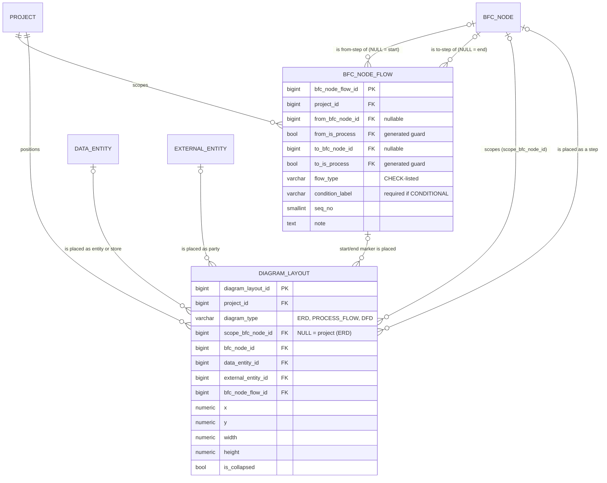

# Slice 2 — process flow: physical schema spec

Author: `apple` · 2026-09-30 · source of truth: `docs/VB_design.md` (signed off 2026-09-28),
with the Slice 1 review rows S1-1…S1-9 (§1a) winning over older text. Section numbers (§) refer
to the design. This spec **does not redesign**. Where the design is silent, ambiguous or
self-contradictory once made physical, the spec shows a **proposed** choice marked **[Q-n]**, and
§5 lists each one for Ben. Nothing marked [Q-n] should be built until Ben has answered it. Q-5 is
already **decided** (Ben, 2026-09-30).

Dialect: **PostgreSQL 16**. The conventions are the ones Slice 1 built (0010, 0012, 0014, 0016):
surrogate identity PK, `(id, project_id)` composite FKs, `vb_ops.live_guard` process guards with
`ON UPDATE NO ACTION`, partial unique indexes `WHERE is_active` in raw `op.execute`,
`audit_columns()`, `updated_at_trigger()`. §0 of `docs/slice1_schema.md` applies unchanged to
`bfc_node_flow`. `diagram_layout` is the documented exception (§5.3, `docs/PLAYBOOK_DEVIATIONS.md`).

---

## 1. `bfc_node_flow` — one flow edge between process steps (D-20, D-23, §5.3, §5.4.14, Q2)

D-20 says "between level-5 nodes". D-23 superseded that: the ends are **process nodes at any of
L3–L5**, and `is_process` is the only test (VB law 4).

| Column | Type | Null | Default | FK | Description |
|---|---|---|---|---|---|
| `bfc_node_flow_id` | bigint identity | NO | identity | — | PK. The baseline `source_id`. Restore-before-insert keeps it stable (§5.4.14) |
| `project_id` | bigint | NO | — | → `project` | tenancy |
| `from_bfc_node_id` | bigint | YES | — | two composites | NULL = start event |
| `from_is_process` | boolean | YES | **GENERATED** `live_guard(TRUE)` | guard | D-23 |
| `to_bfc_node_id` | bigint | YES | — | two composites | NULL = end event |
| `to_is_process` | boolean | YES | **GENERATED** `live_guard(TRUE)` | guard | D-23 |
| `flow_type` | varchar(20) | NO | — | — | **CHECK-listed, not code_master (Q-5, decided)** |
| `condition_label` | varchar(200) | YES | — | — | the branch condition. Required on CONDITIONAL, by CHECK |
| `seq_no` | smallint | YES | — | — | display order of a node's outbound edges **[Q-3]** |
| `note` | text | YES | — | — | |
| §0 audit columns | | | | | `created_*`, `updated_*`, `is_active`, `deleted_*`, `row_version` |

**Keys and FKs**
- PK `bfc_node_flow_id`.
- UK `uq_bfc_node_flow_project (bfc_node_flow_id, project_id)`. This is the composite target for `diagram_layout.bfc_node_flow_id`.
- `fk_bnf_from (from_bfc_node_id, project_id) → bfc_node(bfc_node_id, project_id)`. This covers existence and tenancy.
- `fk_bnf_from_process (from_bfc_node_id, project_id, from_is_process) → bfc_node(bfc_node_id, project_id, is_process) ON UPDATE NO ACTION`, targeting `uq_bfc_node_process_target`.
- `fk_bnf_to` and `fk_bnf_to_process` follow the same shape for `to`. Under MATCH SIMPLE, a NULL end skips both of its FKs, which is what a start or end event needs.

**CHECKs**
- `ck_bnf_has_end (num_nonnulls(from_bfc_node_id, to_bfc_node_id) >= 1)`
- `ck_bnf_flow_type (flow_type IN ('SEQUENCE','CONDITIONAL','PARALLEL','HANDOFF'))`
- `ck_bnf_label_not_blank (condition_label IS NULL OR btrim(condition_label) <> '')`
- **`ck_bnf_conditional_label (flow_type <> 'CONDITIONAL' OR condition_label IS NOT NULL)`**. Together with the not-blank CHECK, a CONDITIONAL edge carries a real label. This is criterion 84, now held by the database.
- `ck_bnf_seq (seq_no IS NULL OR seq_no BETWEEN 1 AND 99)` **[Q-3]**
- There is **no** `from <> to` CHECK. Self-loops are legal **[Q-6]**, and so are cycles (§5.3). There is no cycle check.

**Unique (Q2, R2-D4)**
```sql
CREATE UNIQUE INDEX uq_bfc_node_flow_edge ON bfc_node_flow
    (from_bfc_node_id, to_bfc_node_id, lower(btrim(condition_label)))
    NULLS NOT DISTINCT WHERE is_active;
```
The index is partial, so the service must restore a retired twin rather than insert a new row. `flow_type` is deliberately not part of the key (§5.3). The two node ids are globally unique, so `project_id` is not needed in the key.

**Indexes** **[Q-1]**
- `ix_bnf_from (from_bfc_node_id, project_id)` and `ix_bnf_to (to_bfc_node_id, project_id)` are **full**, not partial. They are the referencing-side indexes for the two guard FKs, and they serve demote, retire, and the replace-mode import's "edges out of / into the steps under the anchor".
- `ix_bnf_project (project_id)` serves `flow_completeness_report` and `consistency_check`.
- The live "edges out of S1" lookup is also served by `uq_bfc_node_flow_edge`.

**Model:** `BfcNodeFlow(AuditMixin, Base)` in `models/bfc.py`, exported from `models/__init__.py`. Its `owning_project_id()` returns `project_id`. The guards use `_live(True)`. The process-FK helper `_process_node_fk(prefix)` hard-codes `bfc_node_id`, so the from and to FKs are written out in full; the existing helper is not changed.

**Service contract (`services/process_flow.py`, §7.2a).**
- **Request fields:** `from`, `to`, `flow_type`, `condition_label`, `seq_no` and `note`.
- **Never taken from the request:** `project_id` (route context), the guards, the audit columns and `row_version` (VB law 6).
- **Each named end must be live, a process and in this project.** The process guard FK proves process-ness only, not liveness. `lifecycle.relink` does not check parents, so `link_process_flow` checks both ends before it restores a twin.
- **Twin search** uses `bfc.normalise_name`. That normaliser is stricter than the index's `lower(btrim())`. If there are several retired twins, the service restores the one with the latest `deleted_at` **[Q-9]**.
- **Endpoints are immutable after create** **[Q-2]**.

---

## 2. `diagram_layout` — one saved position per (project × diagram × scope × object) (D-29, D-30, §5.3, §5.4.10)

This table serves PROCESS_FLOW now and DFD and ERD in Slice 3, with no later schema change. It is **hard-deleted**, has **no `is_active` / `deleted_*` / `row_version`**, and is **never baselined** (documented deviation, A-52).

| Column | Type | Null | Default | FK | Description |
|---|---|---|---|---|---|
| `diagram_layout_id` | bigint identity | NO | identity | — | PK |
| `project_id` | bigint | NO | — | → `project` | |
| `diagram_type` | varchar(20) | NO | — | — | `ERD` / `PROCESS_FLOW` / `DFD`, a CHECK (§8) |
| `scope_bfc_node_id` | bigint | YES | — | composite | the node the flow or DFD is drawn for, or the ERD subject area. NULL = whole project (ERD only). **Not process-guarded** (§5.4.7) **[Q-14]** |
| `bfc_node_id` | bigint | YES | — | composite | a step box, or a hand-off target outside the frame |
| `data_entity_id` | bigint | YES | — | composite | an ERD entity, or a flow/DFD store |
| `external_entity_id` | bigint | YES | — | composite | an external party |
| `bfc_node_flow_id` | bigint | YES | — | composite | the start/end event marker of an edge with a NULL end |
| `x` | numeric(10,2) | NO | — | — | |
| `y` | numeric(10,2) | NO | — | — | |
| `width` | numeric(10,2) | YES | — | — | |
| `height` | numeric(10,2) | YES | — | — | |
| `is_collapsed` | boolean | NO | false | — | ERD card "+12 more" |
| `created_at`, `updated_at` | timestamptz | NO | now() | — | `updated_at` is set by the trigger, never `onupdate=` |
| `created_by` | bigint | NO | — | → `app_user` | the first placer (not overwritten on upsert) |
| `updated_by` | bigint | YES | — | → `app_user` | the last dragger (Ben's ask) |

**Keys and FKs.** All FKs are NO ACTION. The composite targets already exist.
- `fk_dl_scope (scope_bfc_node_id, project_id) → bfc_node(bfc_node_id, project_id)`
- `fk_dl_node (bfc_node_id, project_id) → bfc_node(bfc_node_id, project_id)`
- `fk_dl_de (data_entity_id, project_id) → data_entity(data_entity_id, project_id)`
- `fk_dl_ext (external_entity_id, project_id) → external_entity(external_entity_id, project_id)`
- `fk_dl_flow (bfc_node_flow_id, project_id) → bfc_node_flow(bfc_node_flow_id, project_id)`
- **Natural key, as a table constraint (not an index):** `uq_dl_object UNIQUE NULLS NOT DISTINCT (project_id, diagram_type, scope_bfc_node_id, bfc_node_id, data_entity_id, external_entity_id, bfc_node_flow_id)`. It must be a constraint so that the upsert can name it in `ON CONFLICT ON CONSTRAINT` **[Q-12]**. It also serves "all positions for this diagram" and the project FK.

**CHECKs (§5.3, §6.2)**
- `ck_dl_type (diagram_type IN ('ERD','PROCESS_FLOW','DFD'))`
- `ck_dl_one_object (num_nonnulls(bfc_node_id, data_entity_id, external_entity_id, bfc_node_flow_id) = 1)`
- `ck_dl_erd_entity (diagram_type <> 'ERD' OR data_entity_id IS NOT NULL)`
- `ck_dl_event_flow_only (diagram_type = 'PROCESS_FLOW' OR bfc_node_flow_id IS NULL)`
- `ck_dl_scope (diagram_type = 'ERD' OR scope_bfc_node_id IS NOT NULL)`
- `ck_dl_width (width IS NULL OR width > 0)` and `ck_dl_height (height IS NULL OR height > 0)`
- *Proposed (apple addition):* `ck_dl_collapse_erd (diagram_type = 'ERD' OR NOT is_collapsed)` **[Q-16]**

The per-type rules above hold in the DB for all three diagram types. So DFD and ERD need no new columns or constraints in Slice 3.

**Indexes.** The UK leads with `project_id, diagram_type, scope_bfc_node_id`, so it serves the diagram fetch (§6.3). Proposed: one partial index per object FK, `ix_dl_scope / ix_dl_node / ix_dl_de / ix_dl_ext / ix_dl_flow (<col>, project_id) WHERE <col> IS NOT NULL` **[Q-15]**.

**Grants.** 0001's default privileges give SELECT/INSERT/UPDATE. The migration adds **`GRANT DELETE ON diagram_layout TO vb_app`**, and its downgrade revokes it. `tests/test_foundation.py::test_app_role_has_no_delete_and_audit_is_append_only` currently asserts there is **no** DELETE at all. It must change to "DELETE only on `{diagram_layout}`" (and `import_row` when that table lands, §6.6). Without this change the test fails the moment 0018 runs.

**Helpers and model.** `audit_columns()` does not fit, because it carries soft delete and `row_version`. `vb_ops.py` is append-only, so a new helper **`presence_columns()`** returns the four audit columns only (`created_at`, `updated_at`, `created_by NOT NULL`, `updated_by`). `updated_at_trigger("diagram_layout")` is still attached. The model is `DiagramLayout(TimestampMixin, Base)` with explicit `created_by` / `updated_by`, and **not** `AuditMixin`, because there is no `version_id_col`. It lives in a new module `models/diagram.py`, exported from `models/__init__.py`. `lifecycle._links()` and `test_lifecycle` already skip tables without `is_active`, so `diagram_layout` is excluded from `FK_LIVENESS` by construction, which matches §5.4.15. No shadow is generated, and no parity test lists it.

**Service contract (`services/diagram_layout.py::save`, the only writer, §13).**
- Every write is an upsert by `uq_dl_object`: last write wins per object, with no 409 (A-52).
- The API's `{object_type, object_id}` (§9) maps to exactly one typed FK. `object_type` is a request enum (`STEP` / `ENTITY` / `EXTERNAL` / `EVENT`) and is never stored.
- `scope_key` is the literal `project` for ERD, meaning NULL scope.
- The service validates that the scope node is live and in the project, that PROCESS_FLOW/DFD scopes are non-process, and that an EVENT object is an edge with a NULL end **[Q-17]**.

---

## 3. Lifecycle (`services/lifecycle.py`, `services/bfc.py`)

| What | Change | Why |
|---|---|---|
| `lifecycle.LINKS` / `dependents_of(BfcNode)` | **Nothing to write.** `_links()` derives two new Links from the metadata: `bfc_node_flow(from_bfc_node_id, project_id) → bfc_node` and `(to_bfc_node_id, project_id) → bfc_node`. Each process-guard FK drops its `is_process` column and dedupes into the plain one. `test_lifecycle` then passes | Retiring a node with a live edge in or out → 409 naming the edges (Q4). This covers every node, not only processes |
| `lifecycle.parents_of(BfcNodeFlow)` | Derived the same way. `inactive_parents` already skips a NULL end | Restoring an edge under a retired node is refused, but only if it goes through `restore()`. See the next row |
| `lifecycle.RESTORABLE` | **Unchanged**: `BfcNodeFlow` is a link row. It returns through `link_process_flow`'s twin restore (`lifecycle.relink`), which must check both ends are live first (§1 service contract) | S1-7 re-link = restore |
| `lifecycle.LABELS` | Add `"bfc_node_flow": ("Flow edge", lambda r: f"{r.flow_type.title()} {r.condition_label or ''}".strip())` | the 409 must name the blocker (§7.12) |
| `bfc._step_blockers` (demote in `mark_process`) | Hand-listed, so it **must** gain a line: count `BfcNodeFlow` where `(from_bfc_node_id = node OR to_bfc_node_id = node) AND is_active`, reported as "N flow edges" | §5.4.7(3). The DB already refuses the demotion through `fk_bnf_*_process`. The service exists to name the blockers instead of surfacing an FK violation |
| Self-loop count | An S1 → S1 edge matches both Links, so `retire` counts it twice. The `_step_blockers` OR query counts it once | cosmetic. Accept, or dedupe by PK in `active_dependents` |
| `diagram_layout` | No liveness role. Retiring any positioned object, or a scope node, is never blocked by layout rows, and the rows stay so that a restored object returns to its place | §5.3, §5.4.15 exclusion |

---

## 4. Baseline shadow

- **`bfc_node_flow`** is baselined as table #11, frozen after `bfc_node_org_role` and before `bfc_node_external_flow` (§6.1 order). `baseline_shadow.shadow_table` produces the following:
  - the generator's columns: `baseline_bfc_node_flow_id`, `baseline_id`, `source_id` (= `bfc_node_flow_id`)
  - the snapshot columns: `project_id`, `from_bfc_node_id`, `to_bfc_node_id`, `flow_type`, `condition_label`, `seq_no`, `note`
  - no guard columns: `from_is_process` and `to_is_process` are generated, so they are dropped (`c.computed`), which is correct
- **What the generator still lacks** (already on the Slice 1 list):
  - **baseline-id remapping of both ends**, as `baseline_from_node_id` and `baseline_to_node_id` pointing at `baseline_bfc_node`. NULL stays NULL.
  - This is the first shadow with two nullable remaps into the same parent shadow.
- **Q-5's payoff:** `flow_type` is a stable literal, so the shadow needs **no** code label resolution for it. Under the code-FK variant it would have needed `flow_type_label`.
- **`content_hash`** **[Q-4]**: hash `from`, `to` (as source ids), `flow_type`, `condition_label` and `note`. Keep `seq_no` in the shadow for rendering, but leave it out of the hash.
- **`diagram_layout`** is never baselined (D-30). No shadow, no parity entry, no reject trigger.

---

## 5. Questions for Ben (recommendation first)

1. **§6.3 index claim does not hold for the guard FKs (defect).** §6.3 says the partial natural-key index "serves edges out of S1". It does serve the app's live query. But the NO ACTION check fired by an `is_process` update runs `WHERE from_bfc_node_id = $1 AND project_id = $2 AND from_is_process = $3`, with no `is_active` predicate, so it cannot use a `WHERE is_active` index. §6.3 also names only `(to_bfc_node_id)`. **Rec:** full `ix_bnf_from (from_bfc_node_id, project_id)` and `ix_bnf_to (to_bfc_node_id, project_id)`, the Slice 1 `ix_*_node` pattern.
2. **PATCH can move an edge's endpoints, and twin-restore on an edit is undefined (gap).** §9 lists `from, to` on `PATCH /process-flows/{id}`. §7.2a "restore the twin and apply the edit" would leave two rows for one edge, and a re-pointed edge keeps its `source_id`, so a diff calls it CHANGED rather than REMOVED + ADDED. **Rec:** `from` and `to` are immutable after create (as on `bfc_node_external_flow`). PATCH carries `flow_type`, `condition_label`, `seq_no` and `note`. Re-pointing is remove + add. Twin-restore applies on create only.
3. **`seq_no` is undefined.** Nullable? Unique? Derived or input? For a start event it orders "outbound of NULL". **Rec:** `smallint NULL`, `CHECK (seq_no IS NULL OR seq_no BETWEEN 1 AND 99)`, no unique (so there is no two-phase reorder and no collisions across a project's start events). Render order is `seq_no NULLS LAST, bfc_node_flow_id`. The consultant sets it as an input, not a derived value.
4. **Is `seq_no` scope?** It is branch display order, the same class of fact as layout. **Rec:** snapshot it, but exclude it from `content_hash`, so that reordering branches is not reported as a scope change.
5. **`flow_type` — DECIDED (Ben, 2026-09-30):** a CHECK column, `varchar(20) NOT NULL CHECK (flow_type IN ('SEQUENCE','CONDITIONAL','PARALLEL','HANDOFF'))`, with `ck_bnf_conditional_label` as a real table CHECK. *(The rejected variant was `flow_type_code_id` + generated `flow_type_category = 'FLOW_TYPE'` + FK to `uq_code_category_target`, with the label rule service-enforced + `consistency_check.conditional_without_label`.)* **What follows (Rec):**
   - Remove `FLOW_TYPE` from `seeds/seed_code_master.py` (line 42). It is seeded today.
   - The global rows already in every seeded database are referenced by nothing, and `vb_app` has no DELETE, so the seed **retires** them (`is_active = false`) once.
   - Drop `consistency_check.conditional_without_label` and `flow_completeness_report.unlabelled_branch`: the CHECK makes them always 0.
   - Amend §5.3 BFC_NODE_FLOW, §6.2 row 2, the R2-D11 list under §6.2 (three service-enforced rules, not four), §8 `FLOW_TYPE` row and the §8 CHECK list (beside `diagram_type`), and D-20's "one `code_master` category".
   - Record it as an S2 row in §1a.
6. **Self-loops (S1 → S1).** The design says loops are legal but never mentions a self-loop. "Repeat until accepted" is a real business pattern. **Rec:** legal, with no CHECK. The flow import warns on one, because an AI conversion producing one is more often an error than intent.
7. **HANDOFF to another project overloads `condition_label`.** §4.14 (the cross-project hand-off row) draws it as a HANDOFF to an end event labelled with the other project, so the "condition" is really a destination name. **Rec:** accept, with no new column. State in §5.3 that on a HANDOFF with a NULL `to`, `condition_label` names the receiving party. The Q2 key then allows one plain end event plus one per named destination.
8. **Liveness of a restored edge is service-only.** The guard FKs prove process-ness, not liveness, and `lifecycle.relink` does not read `parents_of`. **Rec:** `link_process_flow` checks both ends are live before restoring a twin (as §7.2a's pseudocode implies). `consistency_check.active_under_inactive` proves it. No schema change.
9. **The DB normaliser is weaker than the service one.** The index uses `lower(btrim())`. `normalise_name` adds NFKC and whitespace collapse, so 「与信ＮＧ」 and 「与信NG」 are one condition to the service and two to the DB. **Rec:** accept, as with the Slice 1 name indexes. The service is the stricter gate. When several retired twins match, restore the one with the latest `deleted_at`.
10. **The DELETE grant breaks an existing test.** `test_foundation` asserts that `vb_app` holds no DELETE anywhere. **Rec:** 0018 grants `DELETE ON diagram_layout`, and the test changes to "the DELETE set is exactly `{diagram_layout}`" (then plus `import_row`), per §6.6. `sara` reviews it, because it touches grants.
11. **No helper fits `diagram_layout`'s columns.** **Rec:** a new append-only `vb_ops.presence_columns()` (four audit columns) and a `DiagramLayout(TimestampMixin, Base)` model without `version_id_col`. Record the model shape next to the existing PLAYBOOK_DEVIATIONS entry.
12. **Concurrent first save races the natural key.** Two consultants dragging the same new object at the same moment both INSERT, and one gets a 500. **Rec:** declare `uq_dl_object` as a table `UNIQUE NULLS NOT DISTINCT` constraint (PG ≥ 15 supports it as an `ON CONFLICT` arbiter). `save` is `INSERT … ON CONFLICT ON CONSTRAINT uq_dl_object DO UPDATE SET x, y, width, height, is_collapsed, updated_by`, so `created_by` is kept.
13. **`PUT /diagram-layouts/{type}/{scope_key}` semantics.** "PUT a list" reads as full replace. That would hard-delete another consultant's positions and contradict "last write wins **per object**" (A-52). **Rec:** PUT upserts only the listed objects. "Reset layout" is a separate explicit action (`DELETE /diagram-layouts/{type}/{scope_key}`, EDITOR, audited as one event) that hard-deletes the scope's rows.
14. **Scope node validity.** A PROCESS_FLOW/DFD scope must be a non-process node, because `generate_process_flow` refuses a process. A generated guard FK would enforce this in the DB, but it would stop a childless node with stale layout rows from being promoted, over a presentation row. §5.4.7 deliberately leaves the scope unguarded. **Rec:** keep it unguarded. `save` validates that the scope is live, non-process for PROCESS_FLOW/DFD, and in the project.
15. **Object-FK indexes.** §6.3 says the UK suffices. That is true for the fetch, but §6.3 also says "every FK gets an index". Without one, `purge_project`'s parent deletes and "where is DE-0007 placed" scan the table. **Rec:** five partial indexes `(<col>, project_id) WHERE <col> IS NOT NULL`. They are small, because each row sets exactly one object column.
16. **apple-added CHECK** `ck_dl_collapse_erd (diagram_type = 'ERD' OR NOT is_collapsed)`. Only the ERD card collapses. **Rec:** accept. It is trivially true for valid data and can be dropped later without harm.
17. **The EVENT marker cannot be DB-checked.** "`bfc_node_flow_id` only for an edge with a NULL end" reads another table. **Rec:** `save` validates it. A stale marker (for example, after an end is later set) is harmless presentation, and there is no consistency line for it.

No migration here is destructive. Both only create, and 0018 also grants. A `downgrade` on populated data is the one destructive act. For `diagram_layout` that is harmless by design, but it still pauses for Ben.

---

## 6. Migration plan (one per commit, reversible, on `main`, in order)

| Rev | Creates | Depends on | Also |
|---|---|---|---|
| 0017 | `bfc_node_flow` + `trg_bfc_node_flow_updated_at` | `bfc_node` (`uq_bfc_node_project`, `uq_bfc_node_process_target`) | `BfcNodeFlow` in `models/bfc.py` + `models/__init__.py`. `LABELS` entry. `_step_blockers` line. Remove FLOW_TYPE from the seed and retire it (a seed change, not Alembic) |
| 0018 | `diagram_layout` + trigger + `GRANT DELETE … TO vb_app` | `bfc_node`, `data_entity`, `external_entity`, `bfc_node_flow` | `vb_ops.presence_columns()`. `models/diagram.py`. Grant test update (Q-10) |

Downgrades: 0018 revokes DELETE, then drops the trigger, then drops the table. 0017 drops the trigger, then the table.

## 7. Rule checks

| Rule | Status |
|---|---|
| `is_process`, never `level_no = 5` (law 4) | ✓ Both ends are guarded on `is_process`. No `level_no` appears in the slice |
| Branch on behaviour, never a code (law 5) | ✓ Resolved by Q-5. `flow_type` is a CHECK-listed literal like `diagram_type` and `crud_code`, not a `code_master` code, so `== 'CONDITIONAL'` is a branch on a closed enum. The label rule is declarative |
| Derived values never from the body (law 6) | Guards, audit, `row_version`, `project_id` (route) and `diagram_layout.created_by` / `updated_by` (JWT) are never read from the body |
| No hard delete (law 1) | ✓ `bfc_node_flow` is soft-deleted. `diagram_layout` is the named exception, with the grant scoped to that table only |
| Baselines immutable (law 2) | `baseline_bfc_node_flow` is generated in the shadow slice and gets `fn_reject_modification()`. `diagram_layout` has no shadow |
| Composite FKs stop cross-project links | ✓ Every intra-scope FK in both tables is `(x_id, project_id)` |

## 8. ER diagram (Slice 2)


