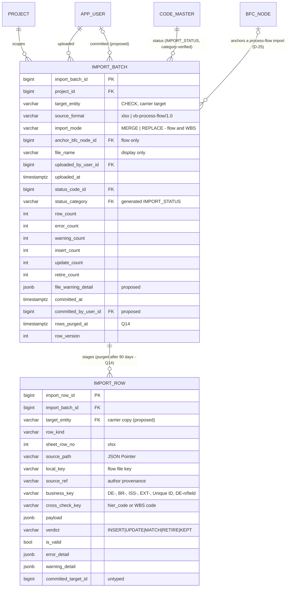

# Slice 4 — import staging: physical schema spec

Author: `apple` · 2026-10-01 · source of truth: `docs/VB_design.md` (signed off 2026-09-28),
with the review rows S1-1…S1-9 and S2-1…S2-6 (§1a) winning over older text. Section numbers (§)
refer to the design. This spec **does not redesign**. Where the design is silent, ambiguous or
self-contradictory once made physical, the spec shows a **proposed** choice marked **[Q-n]**, and
§5 lists each one for Ben. Nothing marked [Q-n] should be built until Ben has answered it.

Scope: the two staging tables of the one import pipeline (VB law 8; §5.3 "Bulk import staging",
§6.2 rows `import_batch` / `import_row`, §7.11, §7.11a, §7.2b, §7.12a, §7.12b). **Slice 4a** uses
them for Data Entity and Data Field `.xlsx`. Every later target — Issue, BR, FR, WBS and the
`vb-process-flow/1.0` JSON — must fit them **with no schema change**, so every column, CHECK and
key that those targets need is born here, even though 4a writes only two `target_entity` values.

Dialect: **PostgreSQL 16**. The conventions are the ones Slices 1–2 built: surrogate identity
PK, `(id, project_id)` composite FKs, `vb_ops.category_column` + FK to `uq_code_category_target`
for every code FK (S1-4), partial and expression indexes in raw `op.execute`,
`updated_at_trigger()`, every FK `NO ACTION`. **Neither table takes `audit_columns()`.** Both
are documented exceptions to VB law 3, and §1 and §2 state exactly what each carries instead and
why **[Q-7]**.

---

## 1. `import_batch` — one uploaded file awaiting validation, review and commit (D-5, D-25, D-28, D-33, Q14)

The header is the **import audit trail**: who uploaded what, when, for which target, with what
counts and outcome. It survives the 90-day row purge, and `wbs_item.last_import_batch_id` will
point at it. It is never deleted by the app (no DELETE grant, §6.6) and never retired: its life
is its status, not `is_active`.

| Column | Type | Null | Default | FK | Description |
|---|---|---|---|---|---|
| `import_batch_id` | bigint identity | NO | identity | — | PK |
| `project_id` | bigint | NO | — | → `project` | tenancy. **From the route context, never the body** |
| `target_entity` | varchar(30) | NO | — | — | CHECK-listed (§8: a CHECK column, not a category). The carrier target for `import_row` **[Q-2]** |
| `source_format` | varchar(40) | NO | `'xlsx'` | — | the declared format, e.g. `vb-process-flow/1.0`. *Which* versions are supported is a service registry, not a CHECK (§5.3) |
| `import_mode` | varchar(10) | YES | — | — | `MERGE` / `REPLACE`, flow JSON and WBS only. Upper-cased by the service (§7.2b `mode.upper()`) |
| `anchor_bfc_node_id` | bigint | YES | — | composite | the flow file's `parent`. Must be a live non-process node: **service-checked at validate and commit, not guard-FK'd** **[Q-18]** |
| `file_name` | varchar(255) | NO | — | — | **display only** — never a path, never a `Content-Disposition` (§7.11). Service-sanitised **[Q-15]** |
| `uploaded_by_user_id` | bigint | NO | — | → `app_user` | from the JWT (VB law 6). This *is* the row's `created_by` **[Q-7]** |
| `uploaded_at` | timestamptz | NO | `now()` | — | this *is* `created_at`. The purge clock (Q14) |
| `status_code_id` | bigint | NO | — | category FK | `IMPORT_STATUS` (D-5, §8) |
| `status_category` | varchar(40) | NO* | **GENERATED `'IMPORT_STATUS'` STORED** | category FK | S1-4 (`vb_ops.category_column`) |
| `row_count` | int | NO | 0 | — | staged `import_row` rows, all kinds **[Q-10]** |
| `error_count` | int | NO | 0 | — | rows with `NOT is_valid`. Errors block the commit |
| `warning_count` | int | NO | 0 | — | rows with a non-empty `warning_detail`. Warnings inform **[Q-10]** |
| `insert_count` | int | NO | 0 | — | rows with verdict `INSERT` — what `acknowledged_inserts` must equal (R2-P2) |
| `update_count` | int | NO | 0 | — | rows with verdict `UPDATE` |
| `retire_count` | int | NO | 0 | — | rows with verdict `RETIRE` — what `acknowledged_retires` must equal |
| `file_warning_detail` | jsonb | NO | `'[]'` | — | *(proposed)* file-level warnings with no row to sit on (ignored columns, skipped MS Project summary row) **[Q-9]** |
| `committed_at` | timestamptz | YES | — | — | set by `commit`, once |
| `committed_by_user_id` | bigint | YES | — | → `app_user` | *(proposed)* the committer, who need not be the uploader **[Q-8]** |
| `rows_purged_at` | timestamptz | YES | — | — | Q14: the detail is gone. A preview of a purged batch says "detail purged", never an empty list (§7.12b) |
| `updated_at` | timestamptz | NO | `now()` | — | set by `trg_import_batch_updated_at`, never `onupdate=` |
| `row_version` | int | NO | 1 | — | `version_id_col`. **Kept** (no soft delete, but concurrency) **[Q-7]** |

\* never NULL: a stored constant.

**Keys and FKs.** All `NO ACTION`.
- PK `import_batch_id`.
- UK `uq_import_batch_project (import_batch_id, project_id)` is the composite target for the
  later `wbs_item.last_import_batch_id` **[Q-19]**.
- UK `uq_import_batch_target (import_batch_id, target_entity)` is the carrier target for
  `import_row` **[Q-2]**.
- `project_id → project(project_id)`. This FK is unnamed, as on every table so far.
- `fk_ib_anchor (anchor_bfc_node_id, project_id) → bfc_node(bfc_node_id, project_id)`. It
  covers existence and tenancy. MATCH SIMPLE skips it when the anchor is NULL.
- `fk_ib_uploaded_by (uploaded_by_user_id) → app_user(app_user_id)` and
  `fk_ib_committed_by (committed_by_user_id) → app_user(app_user_id)`.
- `fk_ib_status_code (status_code_id, status_category) → code_master(code_id, category) ON UPDATE NO ACTION`,
  targeting `uq_code_category_target` (S1-4).

**CHECKs.** The first five come from the design (§5.3, §6.2). The rest are **apple additions
[Q-20]**.
- `ck_ib_target_entity (target_entity IN ('ISSUE','DATA_ENTITY','DATA_FIELD','BUSINESS_REQUIREMENT','FUNCTION_REQUIREMENT','PROCESS_FLOW','WBS_ITEM'))`
- `ck_ib_flow_format ((target_entity = 'PROCESS_FLOW') = (source_format LIKE 'vb-process-flow/%'))`
- `ck_ib_import_mode (import_mode IN ('MERGE','REPLACE'))`. NULL passes.
- `ck_ib_mode_targets ((target_entity IN ('PROCESS_FLOW','WBS_ITEM')) = (import_mode IS NOT NULL))` (D-33)
- `ck_ib_flow_anchor ((target_entity = 'PROCESS_FLOW') = (anchor_bfc_node_id IS NOT NULL))` (D-25)
- `ck_ib_counts_nonneg (least(row_count, error_count, warning_count, insert_count, update_count, retire_count) >= 0)`
- `ck_ib_counts_bounded (error_count <= row_count AND warning_count <= row_count AND insert_count + update_count + retire_count <= row_count)` **[Q-10]**
- **`ck_ib_retire_needs_replace (retire_count = 0 OR import_mode IS NOT DISTINCT FROM 'REPLACE')`**. *(Tightened at build: with `= 'REPLACE'` a NULL mode let the CHECK pass.)* "Merge never retires" (§7.2b rule 7, §7.11a) is now held by the database.
- `ck_ib_committed_pair ((committed_at IS NULL) = (committed_by_user_id IS NULL))` **[Q-8]**
- `ck_ib_commit_after_upload (committed_at IS NULL OR committed_at >= uploaded_at)` and `ck_ib_purge_after_upload (rows_purged_at IS NULL OR rows_purged_at >= uploaded_at)`
- `ck_ib_file_name (btrim(file_name) <> '')` and `ck_ib_source_format (btrim(source_format) <> '')`
- `ck_ib_file_warning_array (jsonb_typeof(file_warning_detail) = 'array')` **[Q-9]**

**Rules that are not CHECKs (the R2-D11 class).** `status_code_id` is a code FK, so a CHECK
cannot read the status code. These rules are therefore service-enforced, with a proof line
**[Q-11]**:
- `committed_at` is set iff the status is COMMITTED.
- A purged batch is REJECTED or COMMITTED.
- A committed batch cannot be re-committed. That is the `FOR UPDATE` row in §6.2, not a CHECK.

**Indexes**
- `ix_ib_purge_due (uploaded_at) WHERE rows_purged_at IS NULL` is the 90-day scan (§6.3).
- `ix_ib_project (project_id, uploaded_at DESC)` serves the project FK, a project's import history and `purge_project`.
- `ix_ib_anchor (anchor_bfc_node_id, project_id) WHERE anchor_bfc_node_id IS NOT NULL` is the FK index (§6.3, "every FK gets an index"). It is partial because 6 of 7 targets leave the column NULL.
- `ix_ib_status (status_code_id)`.
- `uploaded_by_user_id` / `committed_by_user_id` are **not** indexed. They are FKs to `app_user`, and the convention is the one in Slice 1 §0.

**Code master: no seed change.** `IMPORT_STATUS` is already in `seeds/seed_code_master.py` with
`VALIDATING`, `VALIDATED`, `REJECTED` and `COMMITTED`, `is_system = True` (§8). The pipeline and
the purge resolve these codes from the **global tier only**, through `code_master.resolve(db,
None, 'IMPORT_STATUS')`. The reason is that the purge is one set-based UPDATE across every
project **[Q-12]**.

**Model:** `ImportBatch(Base)` in a new `models/import_staging.py` (`import` is a keyword),
exported from `models/__init__.py`. It is **not** `AuditMixin`, because there is no `is_active`
or `deleted_*`. It is also not `TimestampMixin`, because the design names `uploaded_at`. It maps
`uploaded_at` and `updated_at` explicitly, plus `row_version` as `version_id_col` (the `AppUser`
shape). `owning_project_id()` returns `project_id`, so `/bulk/batches/{batch_id}` declares
`object_guard(ImportBatch, EDITOR)` and a batch in a project you cannot see is a 404.

---

## 2. `import_row` — one staged sheet row or staged JSON object (D-5, D-25, R2-D1, Q14)

Staging is forensic and short-lived. Rows are **hard-deleted 90 days after their batch's
`uploaded_at`** (Q14, deviation 7b). The pipeline writes them only while it holds its batch. They
carry **no audit columns, no soft delete and no `row_version`**: their provenance is the batch
header **[Q-7]**.

| Column | Type | Null | Default | FK | Description |
|---|---|---|---|---|---|
| `import_row_id` | bigint identity | NO | identity | — | PK |
| `import_batch_id` | bigint | NO | — | carrier FK | |
| `target_entity` | varchar(30) | NO | — | carrier FK | *(proposed)* a copy of the batch's target, **written by the service from the batch, never the body**. It lets the DB check `row_kind` and the locator **[Q-2]** |
| `row_kind` | varchar(30) | NO | — | — | the sheet's target, or the flow object kind (§5.3) |
| `sheet_row_no` | int | YES | — | — | `.xlsx` row number (row 1 = header). The locator every sheet error is reported by (criterion 12b) |
| `source_path` | varchar(200) | YES | — | — | JSON Pointer, `/steps/3/inputs/0` |
| `local_key` | varchar(50) | YES | — | — | file-local key `S1` / `D1` / `X1` / `L1` (flow only) |
| `source_ref` | varchar(200) | YES | — | — | author provenance, verbatim ("slide 4, shape 12", §7.2b rule 8) |
| `business_key` | varchar(250) | YES | — | — | `DE-0007`, `BR-0042`, `ISS-0001`, `EXT-0003`, MS Project Unique ID as text; `DE-0007/<field name>` for a data field **[Q-6]**. Canonicalised by the service |
| `cross_check_key` | varchar(100) | YES | — | — | the file's `hier_code` (BR, STEP) or WBS code. **Compared, never used to resolve** (R2-D1) |
| `payload` | jsonb | NO | `'{}'` | — | §3.1 |
| `verdict` | varchar(10) | NO | — | — | `INSERT` / `UPDATE` / `MATCH` / `RETIRE` / `KEPT`. Set on invalid rows too, as the *intended* verdict **[Q-10]** |
| `is_valid` | boolean | NO | — | — | no default: the service states it, and the CHECK proves it agrees with `error_detail` |
| `error_detail` | jsonb | NO | `'[]'` | — | §3.2. Errors block |
| `warning_detail` | jsonb | NO | `'[]'` | — | §3.2. Warnings inform |
| `committed_target_id` | bigint | YES | — | **none (untyped)** | the live row this row inserted, updated, matched or retired, set at commit. `row_kind` says which table **[Q-4]** |

**Keys and FKs**
- PK `import_row_id`.
- **`fk_ir_batch (import_batch_id, target_entity) → import_batch(import_batch_id, target_entity)`**
  targets `uq_import_batch_target` **[Q-2]**. If Q-2 is declined, this is a plain
  `import_batch_id → import_batch` and the `target_entity` column goes. `ON DELETE NO ACTION`:
  rows are deleted before their batch, and only `purge_project` (owner role) ever deletes a
  batch.
- `uq_ir_sheet_row UNIQUE (import_batch_id, sheet_row_no)` and `uq_ir_source_path UNIQUE
  (import_batch_id, source_path)` are table constraints. NULLs are distinct, so a flow batch's
  NULL `sheet_row_no` values do not collide. They mean one sheet row or one pointer is one
  staged row, so "row 14" is unambiguous. `uq_ir_sheet_row` is also the FK index, the purge's
  `DELETE … WHERE import_batch_id IN …` and the ordered fetch **[Q-21]**.
- Partial UK (design) `uq_ir_local_key ON import_row (import_batch_id, row_kind, local_key) WHERE local_key IS NOT NULL`
- Partial UK (design, R2-D1) `uq_ir_business_key ON import_row (import_batch_id, row_kind, business_key) WHERE business_key IS NOT NULL`
- Both partial indexes are a **backstop**. The service detects duplicates first, so a duplicate
  becomes a row error rather than a unique violation that aborts the whole upload **[Q-5]**.

**CHECKs.** The design's CHECKs are kept by meaning, and one of them is corrected **[Q-1]**. The
apple additions are marked **[Q-20]**.
- `ck_ir_row_kind (row_kind IN ('ISSUE','DATA_ENTITY','DATA_FIELD','BUSINESS_REQUIREMENT','FUNCTION_REQUIREMENT','WBS_ITEM','STEP','STEP_IO','STEP_ROLE','FLOW_EDGE','EXTERNAL_ENTITY','EXTERNAL_FLOW','LANE'))`. This is the union (§5.3).
- `ck_ir_kind_fits_target`. "For a sheet it equals `target_entity`" (§5.3) **[Q-2]**:
  ```sql
  CASE WHEN target_entity = 'PROCESS_FLOW'
       THEN row_kind IN ('STEP','STEP_IO','STEP_ROLE','FLOW_EDGE','EXTERNAL_ENTITY',
                         'EXTERNAL_FLOW','DATA_ENTITY','LANE')
       ELSE row_kind = target_entity END
  ```
- **`ck_ir_locator`** replaces §6.2's `num_nonnulls(sheet_row_no, source_path) = 1`. That CHECK rejects every RETIRE and KEPT row, because those rows are staged from the database and have no place in the file **[Q-1]**:
  ```sql
  CASE WHEN verdict IN ('RETIRE','KEPT') THEN num_nonnulls(sheet_row_no, source_path) = 0
       WHEN target_entity = 'PROCESS_FLOW' THEN source_path IS NOT NULL AND sheet_row_no IS NULL
       ELSE sheet_row_no IS NOT NULL AND source_path IS NULL END
  ```
  If Q-2 is declined, the fallback is `num_nonnulls(sheet_row_no, source_path) = CASE WHEN verdict IN ('RETIRE','KEPT') THEN 0 ELSE 1 END`.
- `ck_ir_verdict (verdict IN ('INSERT','UPDATE','MATCH','RETIRE','KEPT'))`
- `ck_ir_valid_matches_errors`. This is the design's `is_valid = (jsonb_array_length(error_detail) = 0)`, made safe. PostgreSQL does not promise the order in which it evaluates `AND`, and `jsonb_array_length` *raises* on a non-array rather than returning false:
  ```sql
  CASE WHEN jsonb_typeof(error_detail) = 'array'
       THEN is_valid = (jsonb_array_length(error_detail) = 0) ELSE false END
  ```
- `ck_ir_warning_array (jsonb_typeof(warning_detail) = 'array')` and `ck_ir_payload_object (jsonb_typeof(payload) = 'object')`
- `ck_ir_db_staged_target (verdict NOT IN ('RETIRE','KEPT') OR payload ? 'target')`. A row staged from the database names what it would retire or keep **[Q-3]**.
- [Q-20] `ck_ir_retire_kinds (verdict <> 'RETIRE' OR row_kind IN ('FLOW_EDGE','STEP_IO','WBS_ITEM'))`. Q5: replace mode retires edges and I/O only, and WBS retires lines (§7.11a).
- [Q-20] `ck_ir_kept_kind (verdict <> 'KEPT' OR row_kind = 'STEP_IO')` (§5.3).
- [Q-20] `ck_ir_lane_match (row_kind <> 'LANE' OR verdict = 'MATCH')`. A lane only resolves, and it is never created (§7.2b rule 4).
- [Q-20] `ck_ir_flow_only_fields (target_entity = 'PROCESS_FLOW' OR (local_key IS NULL AND source_ref IS NULL))`.
- [Q-20] `ck_ir_sheet_row (sheet_row_no IS NULL OR sheet_row_no BETWEEN 2 AND 1048576)` and `ck_ir_source_path (source_path IS NULL OR left(source_path, 1) = '/')`.
- [Q-20] `ck_ir_keys_not_blank ((local_key IS NULL OR btrim(local_key) <> '') AND (business_key IS NULL OR btrim(business_key) <> '') AND (cross_check_key IS NULL OR btrim(cross_check_key) <> ''))`. A blank key cell is stored as NULL, never as `''`, so "blank key → insert" (§7.11) has one representation.
- [Q-4] `ck_ir_target_kind (committed_target_id IS NULL OR row_kind <> 'LANE')`.

**Indexes.** None beyond the four unique ones. There is no index on `committed_target_id`:
nothing looks a staged row up by its target, and the pointer is untyped (§5.3).

**Model:** `ImportRow(Base)` in `models/import_staging.py`, with no mixin. It has no
`owning_project_id()`, because no route addresses a row directly; rows are reached through their
batch. A later in-preview resolution route (the stakeholder pick, D6) would address the batch and
name the row in the body.

---

## 3. How the `jsonb` columns are shaped

The DB enforces only the **container type** (object vs array; CHECKs above). Pydantic models in
`schemas/import_staging.py` own the element shape. These payloads are purged at 90 days, so a
shape change never needs a data migration. Every string in them is rendered **as text**, never
as HTML (VB law 9). Every cell that reaches an export goes through `escape_cell()`.

### 3.1 `import_row.payload` — an object, one envelope for every kind **[Q-14]**

> **Amended by S4-11 (Ben, 2026-10-01):** at commit each UPDATE row also stores its before-values in `payload.before`, kept 90 days from `committed_at`. Preview before/after is still computed live, never stored.

| Key | When | Content |
|---|---|---|
| `v` | always | envelope version, `1` |
| `cells` | sheet rows | the parsed row **keyed by the `COLUMN_MAP` column code**, not the header text (headers are translated, codes are not). Values are JSON scalars: text as string, numbers as number, an Excel-typed date as an ISO `YYYY-MM-DD` string, empty as `null`. Formulas are read as cached values (`data_only=True`, §7.12). Includes the protected `row_version` cell (finding D2) |
| `object` | flow rows | the JSON object as parsed, after `enforce_json_limits` (§7.12a). Includes the step's `row_version` (R2-D5) |
| `resolved` | when anything resolved | ids found at **validate**, advisory only. Commit re-resolves everything (§7.11 property 5). Examples: `target_id`, `target_row_version`, `data_entity_id` (a field's parent), `suggested_br_id` (D-34), `org_role_id` (lane) |
| `target` | RETIRE / KEPT rows (required, `ck_ir_db_staged_target`) | `{table, id, label}`. The live row the database-staged verdict is about, and the preview line ("edge BR-0012 → BR-0015, 'Credit check failed'") **[Q-3]** |

**Before/after is not stored.** The preview computes it against the live rows when it is asked
(§7.11 `preview`). A value captured at validate would be Tuesday's, shown on Thursday as
"current" **[Q-14]**.

Slice 4a examples:

```json
{"v": 1,
 "cells": {"de_number": "DE-0007", "de_name": "Sales order", "description": "One customer order",
           "business_owner_note": null, "row_version": 3},
 "resolved": {"target_id": 412, "target_row_version": 3}}
```
```json
{"v": 1,
 "cells": {"de_number": "DE-0007", "field_name": "customer_id", "data_type": "INTEGER",
           "is_mandatory": "Y", "is_primary_key": "N", "is_foreign_key": "Y",
           "ref_de_number": "DE-0002", "ref_field_name": "customer_id", "row_version": null},
 "resolved": {"data_entity_id": 412, "ref_data_entity_id": 398, "ref_data_field_id": 5120}}
```
The data-field row above has `business_key = 'DE-0007/customer_id'` and verdict `INSERT` (no
live field of that name) **[Q-6]**.

A later replace-mode flow row looks like this:
```json
{"v": 1, "target": {"table": "bfc_node_flow", "id": 991,
                    "label": "BR-0012 → BR-0015 'Credit check failed'"}}
```

### 3.2 `error_detail` / `warning_detail` — arrays of message objects **[Q-13]**

```json
[{"code": "ROW_STALE", "column": "description",
  "message": "Row changed since export. Current value: “One sales order”",
  "params": {"current": "One sales order"}}]
```
- `code` is a stable SCREAMING_SNAKE identifier. The screen renders `t('import.msg.<code>', params)`, which keeps the i18n rule.
- `column` is a `COLUMN_MAP` code or a JSON field name, or `null` for the whole row.
- `message` is the English fallback.
- `params` is a flat object of scalars.
- An empty array means none. `is_valid` is true exactly when `error_detail` is `[]`.
- `import_batch.file_warning_detail` has the same element shape **[Q-9]**.

---

## 4. Lifecycle, grants, baseline

| What | Change | Why |
|---|---|---|
| `lifecycle.LINKS` / `FK_LIVENESS` | **Nothing to write.** Neither table has `is_active`, so `lifecycle._links()` and `test_lifecycle` skip both of them and every FK *to* them (`target.c` lacks `is_active`). That includes the future `wbs_item.last_import_batch_id`. A staged batch never blocks retiring its anchor node, and an anchor's retirement never touches the batch | §5.4.15 lists `import_batch` / `import_row` as excluded (forensic). The exclusion holds by construction, as for `diagram_layout` |
| `lifecycle.RESTORABLE` / `LABELS` | Unchanged. Batches are never retired, and rows are never restored | §7.12 |
| **Grants, `import_batch`** | 0001's default privileges give SELECT/INSERT/UPDATE. **No DELETE.** *Proposed:* `REVOKE UPDATE ON import_batch FROM vb_app; GRANT UPDATE (status_code_id, row_count, error_count, warning_count, insert_count, update_count, retire_count, file_warning_detail, committed_at, committed_by_user_id, rows_purged_at, row_version) ON import_batch TO vb_app`. Who, when, what target, which file and which anchor become write-once for the app role. `updated_at` is left out on purpose, because only the trigger writes it. `SELECT … FOR UPDATE` still works, since it needs UPDATE on any one column **[Q-17]**. **Amended by S4-11/Q6:** `file_name` joins the column grant, because the 90-day purge sets it to `'(purged)'` (a file name can identify a person); who, when, what target and which anchor stay write-once | §6.6: "the import trail"; the `baseline` column-grant precedent |
| **Grants, `import_row`** | Default SELECT/INSERT/UPDATE, **plus `GRANT DELETE ON import_row TO vb_app`** (the 90-day purge, Q14). The downgrade revokes it. `tests/test_foundation.py::HARD_DELETE_TABLES` becomes `{"diagram_layout", "import_row"}`. If Q-17 is taken, the same test asserts `("import_batch", "UPDATE") not in` the table-level privileges, plus the column list from `information_schema.column_privileges`. The optional `vb_maintenance` role (§6.6) is **deferred** **[Q-17]** | §6.6, deviation 7b |
| RLS | None (§6.4) | — |
| Baseline shadow | **None.** Not baselined, so no shadow, no reject trigger and no parity entry | §6.1 rows 45–46 |
| `audit_event` | `IMPORT_COMMITTED` (`target_table='import_batch'`, `target_id`, detail `{entity, mode?, anchor?, insert_count, update_count, retire_count}`) and `IMPORT_ROWS_PURGED` (detail `{batches, rows, cutoff}`). `event_type` is a plain varchar, so there is no schema change | §7.11, §7.12b |
| `purge_project` (Q15, owner role) | Deletes `import_row`, then `import_batch`, for the project, **before** `bfc_node` (`fk_ib_anchor`). When WBS lands, it also deletes `wbs_item` before `import_batch` | §15.3 |
| Test wipe (`conftest.DATA_TABLES`) | No change. `TRUNCATE project, app_user … CASCADE` reaches both tables through their FKs | landmine 1 |
| `PLAYBOOK_DEVIATIONS.md` | Add **7c**: "`import_batch` has no soft delete (its status is its lifecycle, and the header is kept as the trail); `import_row` carries no audit columns or `row_version` (staging, provenance = its batch)". 7b already covers the hard delete **[Q-7]** | VB law 3 |

**Service contract (the part of `bulk.py` the schema depends on).**
- **Validate is one transaction** **[Q-11]**. It inserts the batch as `VALIDATING`, streams rows
  in under `enforce_upload_limits` / `enforce_json_limits`, sets the counts and sets
  `VALIDATED`, even when `error_count > 0` (§7.11 pseudocode). A crash leaves nothing behind.
- **Before any INSERT, canonicalise:**
  - a blank key cell becomes NULL;
  - `BR-`/`DE-`/`ISS-`/`EXT-` numbers are trimmed and upper-cased;
  - a Unique ID is stored as a decimal with no leading zeros;
  - a data-field key is `de_number || '/' || bfc.normalise_name(field_name)` (Q-6).
- **Duplicates are found in memory first** **[Q-5]**. The first occurrence keeps its key. Every
  later occurrence is staged with `business_key` (or `local_key`) NULL, the cell kept in
  `payload`, and the error `DUPLICATE_KEY` naming the first row. The unique indexes never fire
  on a well-behaved run.
- **Over-long values** **[Q-15]**:
  - A key cell longer than its column is a row error, and the key is stored NULL with the raw
    cell kept in `payload`.
  - Flow `source_ref` and `key` are capped by the JSON Schema (`maxLength` 200 / 50), so an
    over-long value is a structural 422 with nothing staged.
- **Commit** works in this order:
  - it takes `SELECT … FROM import_batch WHERE import_batch_id = :id FOR UPDATE` first;
  - it re-checks status and both acknowledgements;
  - it re-validates every row;
  - it writes `committed_target_id` per row and sets `COMMITTED`, `committed_at` and
    `committed_by_user_id` (§7.11).
  - If the re-validation fails, it rolls back. Then, in a second short transaction, it writes
    the fresh errors onto the rows and sets the batch `REJECTED`, so the preview explains why
    (criterion 39) **[Q-11]**.
- **Purge** locks batches before it deletes their rows **[Q-16]**: `SELECT import_batch_id FROM import_batch WHERE uploaded_at < now() - interval '90 days' AND rows_purged_at IS NULL FOR UPDATE SKIP LOCKED`. Then it runs, in order:
  - `DELETE FROM import_row WHERE import_batch_id = ANY(:ids)`;
  - `UPDATE import_batch SET rows_purged_at = now(), status_code_id = CASE WHEN status_code_id IN (:validating, :validated) THEN :rejected ELSE status_code_id END, row_version = row_version + 1 WHERE import_batch_id = ANY(:ids)`.

  This is a Core statement, so it bumps `row_version` itself. A batch that is mid-commit at that
  moment is skipped and purged the next day.

**Slice 4a specifics** (Data Entity, Data Field `.xlsx`; no new column):

| | `DATA_ENTITY` row | `DATA_FIELD` row |
|---|---|---|
| `business_key` | `de_number`, or NULL when blank → INSERT | `DE-0007/<normalised field name>`. Resolves to a live field → UPDATE (or MATCH if nothing changed); otherwise INSERT **[Q-6]** |
| `cross_check_key` | NULL | NULL |
| typical errors | unknown or other-project `DE-` number (12e); stale `row_version` (D2); a blank-number row whose name collides with a live DE (`uq_de_name_live`, S1-6), or with another INSERT row in the file | parent DE missing or retired (and re-checked at commit, criterion 39); `data_type` not in `FIELD_DATA_TYPE` via `code_master.resolve`; the `data_field` CHECKs (`ck_df_*`) pre-checked per row so that commit never meets them first |
| `import_mode` | NULL (a mode on these targets → 422, §7.11) | NULL |

---

## 5. Questions for Ben (recommendation first)

1. **The locator CHECK rejects every RETIRE and KEPT row (defect).** §5.3/§6.2 have `CHECK (num_nonnulls(sheet_row_no, source_path) = 1)`. RETIRE rows (WBS replace, flow replace) and KEPT rows are staged **from the database** (§5.3). They have no sheet row and no JSON Pointer, so replace mode cannot stage a single one. **Rec:** `ck_ir_locator` as in §2. A DB-staged row has neither locator, a flow row has a pointer and a sheet row has a row number.
2. **`row_kind` must match its batch's target, but only the service can see that.** "For a sheet it equals `target_entity`" reads another table. **Rec:** copy `target_entity` onto `import_row` (the house carrier pattern, like `br_data_entity.bfc_node_id`), with the composite FK `fk_ir_batch → uq_import_batch_target` and `ck_ir_kind_fits_target`. That makes the kind rule, the locator rule and "local keys are flow-only" declarative, for one varchar column and one UK.
3. **Where a DB-staged row says what it retires.** The pseudocode writes `target=e`, and no column exists for it. `committed_target_id` means "after commit". **Rec:** `payload.target = {table, id, label}`, required on RETIRE and KEPT by `ck_ir_db_staged_target`. A WBS RETIRE row also carries its Unique ID in `business_key`. At commit, `committed_target_id` is the retired row's id. There is no new column.
4. **`committed_target_id` for `STEP_IO` / `STEP_ROLE` (outdated text).** §5.3 says it stays NULL for composite-key targets. S1-5 gave `bfc_node_data_entity` and `bfc_node_org_role` surrogate PKs, so the stated reason no longer holds. **Rec:**
   - set it for every committed or matched row, including those two kinds;
   - leave it NULL only on LANE rows (resolution only, `ck_ir_target_kind`) and on rows never committed;
   - amend §5.3.
5. **Duplicate keys versus the unique indexes.** "A duplicate key is a staging error" (§5.3). But a unique violation raised while staging aborts the whole validate transaction, which turns a per-row error into a failed upload and breaks P10's "never a 500". **Rec:** the service detects duplicates in memory first. Later occurrences are staged with the key NULL and a `DUPLICATE_KEY` error naming the first row. The indexes stay as the backstop.
6. **A data field has no business key (blocks 4a).** §7.11's "blank key → insert, populated → update" assumes a minted number, and fields have none. The ten series do not include one (R2-D14). **Rec:**
   - `business_key = DE-number + '/' + normalise_name(field_name)`, which is unique among live fields by `uq_df_name_live` (S1-6); `varchar(250)`, because 20 + 1 + 200 fits;
   - a key that resolves → UPDATE, otherwise INSERT;
   - **a rename is not possible by import**: a renamed field arrives as an acknowledged INSERT and the old field is untouched, because merge never retires;
   - the alternative is exporting `data_field_id` as a protected column, like `row_version`. It allows renames, but puts surrogate ids in client hands and lets a pasted row update a different field.
7. **Audit-column shape of both tables (law 3 exemptions).** **Rec:**
   - **`import_batch`**:
     - no `is_active` / `deleted_*`: it is never retired, its status is its lifecycle, and its absence is what excludes it from FK_LIVENESS;
     - `uploaded_at` / `uploaded_by_user_id` are its `created_at` / `created_by` under the design's names;
     - `updated_at` comes from the trigger;
     - no `updated_by`: the purge has no user, and the commit has Q-8;
     - **`row_version` kept** (see Q-11 and the commit body below).
   - **`import_row`**: nothing. It is staging, written only under its batch, and purged.
   - Record both as deviation **7c**.
   - Commit body: add the batch `row_version` to `POST /bulk/batches/{id}/commit` (stale → 409). This only bites once in-preview edits exist (the D6 stakeholder pick), but the column must be born now.
8. **Who committed is not recorded.** The header is "who, when, entity, counts, outcome", and any EDITOR may commit someone else's upload. `audit_event` has it, but `audit_event` is not the header. **Rec:** add `committed_by_user_id` (JWT) with `ck_ib_committed_pair`.
9. **File-level warnings have no home.** "Column X ignored", "MS Project summary row skipped" (§7.11a) and similar belong to no row. **Rec:** add `import_batch.file_warning_detail jsonb NOT NULL DEFAULT '[]'`, in the §3.2 shape. It survives the purge. That is acceptable because it holds column names, never cell values. File-level *errors* stay 422 with nothing staged.
10. **Count semantics.** The design names six counts without defining them. **Rec:**
    - `row_count` = staged rows of every kind, DB-staged included;
    - `error_count` = invalid rows, as in the pseudocode;
    - `warning_count` = rows with any warning;
    - `insert` / `update` / `retire_count` = rows by verdict, invalid rows included, so the preview totals add up;
    - MATCH and KEPT are not counted on the header;
    - an invalid row still carries its intended verdict;
    - MATCH means "resolves to an existing row and changes nothing": a resolved DE, EXT or lane, or an R2-D6 row whose only change was `effort_days`;
    - add `ck_ib_counts_nonneg`, `ck_ib_counts_bounded` and `ck_ib_retire_needs_replace`.
11. **Status transitions, and the rules no CHECK can hold.** **Rec:**
    - `VALIDATING` exists only inside the validate transaction;
    - `VALIDATED` at the end, even with errors (pseudocode; commit refuses with 422);
    - `COMMITTED` by commit;
    - `REJECTED` by the purge (Q14), **and** by a commit whose re-validation fails, set in a follow-up transaction with the fresh errors written to the rows (criterion 39: "the batch is rejected");
    - a REJECTED batch is final: re-upload;
    - "`committed_at` iff COMMITTED" and "purged ⇒ REJECTED or COMMITTED" read a code FK, so they are service-enforced, with a `consistency_check.import_batch_status_drift` line;
    - the alternative, making status a CHECK column like `flow_type`, contradicts §8's `IMPORT_STATUS`, so it is not recommended.
12. **IMPORT_STATUS tier.** `bulk` branches on these codes, and the purge updates every project in one statement. A project override would get a different `code_id` and escape the purge's `IN (…)`. **Rec:** resolve IMPORT_STATUS from the global tier only (`code_master.resolve(db, None, …)`), and the future `code_master.maintain` refuses project overrides of any `is_system` category. No seed change: the four rows exist, `is_system = True`.
13. **Message shape.** The pseudocode appends bare English strings, and screens must use `t()` with no hard-coded UI text. **Rec:** objects `{code, column, message, params}` (§3.2). The DB checks only that the column is an array; Pydantic owns the elements.
14. **Payload envelope, and whether before/after is stored.** §7.2b stores `before_after` in the STEP payload, while §7.11 computes it in `preview`. **Rec:**
    - the §3.1 envelope (`v`, `cells` | `object`, `resolved`, `target`);
    - **before/after is computed at preview against live rows, never persisted**, so a Thursday preview never shows Tuesday's values as current;
    - commit re-validates regardless.
15. **Text lengths at the boundary.** `source_ref varchar(200)`, `local_key varchar(50)` and `file_name` are fed from a file. **Rec:**
    - the `vb-process-flow/1.0` JSON Schema declares `maxLength` 200 on `source_ref` and 50 on `key`, so an over-long value is a structural 422, not a DB error;
    - an over-long sheet key cell is a row error, stored with the key NULL;
    - `file_name` is the basename, with control characters stripped and truncated to 255, and `upload.<ext>` when the client sends none.
16. **Purge and commit can deadlock.** As written, the purge deletes rows and then updates the batch. A commit holds the batch and then updates rows. The two lock orders are opposite. **Rec:** the purge locks the expired batches first, with `FOR UPDATE SKIP LOCKED`. A batch mid-commit is purged the next day, and the commit's in-lock status re-check is unchanged.
17. **Grants.** **Rec:**
    - (a) `GRANT DELETE ON import_row` in 0020, as §6.6 states, with the grant test set to `{diagram_layout, import_row}`;
    - (b) *apple addition*: on `import_batch`, a column-level UPDATE grant leaving out the who / when / what columns, so the trail is write-once for the app role (the `baseline` precedent). **Amended by S4-11/Q6:** `file_name` is in the grant, so the purge can set it to `'(purged)'`;
    - (c) defer the optional `vb_maintenance` role. It needs a third bootstrap role and an Azure identity, and it can be added later with no table change.
    - `sara` reviews this, because it touches grants and imports.
18. **No process guard on the anchor.** A generated constant-FALSE guard FK would stop the anchor node from ever being promoted to a process, permanently, because a batch is never retired. That would let staging pin a business row, which §5.4.15 rules out. **Rec:** keep the plain composite FK (existence + tenancy). Live and non-process are checked at validate and again at commit, as §5.3 says.
19. **`uq_import_batch_project` now.** `wbs_item.last_import_batch_id` (D-33) should be a composite FK, so a WBS line cannot cite another project's batch. **Rec:** create the UK in 0019, so the WBS slice adds no constraint to this table.
20. **apple-added CHECKs.** The verdict/kind compatibility checks, not-blank keys, `sheet_row_no` 2–1,048,576, the leading `/` on a pointer, timestamp order, a not-blank file name and format, and the jsonb container types. **Rec:** accept. Each is trivially true for valid data and turns a pipeline bug into a DB error instead of a bad preview.
21. **One staged row per sheet row or per pointer.** **Rec:** `uq_ir_sheet_row` and `uq_ir_source_path` as table constraints. They make "row 14" unambiguous, and the first one is also the FK, purge and fetch index. The design has no index for `import_row.import_batch_id` at all.
22. **Design flag, not schema: criterion 40 vs all-or-nothing.** Criterion 40 says a stale row is an error "and the other rows still commit", while §7.11 property 2 says one invalid row rejects the batch. **Rec:** read 40 as "after the consultant fixes or drops that row and re-uploads", and amend its wording. Partial commit would need an "excluded" flag on `import_row` and is not specified.

No migration here is destructive: both only create, and 0019/0020 also grant. A `downgrade` on
populated data is destructive: it drops the import trail. Pause for Ben.

---

## 6. Migration plan (one per commit, reversible, on `main`, in order)

The current head is **0018** (`diagram_layout`). Coordinate on `main` before creating either
revision (CLAUDE.md, parallel sessions).

| Rev | Creates | Depends on | Also |
|---|---|---|---|
| 0019 | `import_batch` with its constraints, the three partial / raw indexes and `trg_import_batch_updated_at`. If Q-17(b) is taken: `REVOKE UPDATE` plus the column `GRANT UPDATE (…)` | `project`, `bfc_node` (`uq_bfc_node_project`), `app_user`, `code_master` (`uq_code_category_target`) | `models/import_staging.py::ImportBatch` + `models/__init__.py` (law 10). `test_schema_parity` sees the partial indexes declared in the model. PLAYBOOK_DEVIATIONS 7c |
| 0020 | `import_row` with its constraints, the two partial UKs and **`GRANT DELETE ON import_row TO vb_app`** | `import_batch` (`uq_import_batch_target`) | `ImportRow` + `__init__`. `test_foundation.HARD_DELETE_TABLES = {"diagram_layout", "import_row"}` |

Downgrades:
- 0020 revokes DELETE, then drops the table.
- 0019 drops the trigger, then the table. The column grants go with the table.

Neither revision touches seeds: IMPORT_STATUS is already seeded.

## 7. Rule checks

| Rule | Status |
|---|---|
| No hard delete (law 1) | ✓ `import_row` is the named exception (Q14, deviation 7b), and DELETE is granted on that table only. `import_batch` has no DELETE, and is never even soft-deleted |
| Audit / soft delete / `row_version` born with the table (law 3) | Documented exemptions (Q-7, deviation 7c). `import_batch` keeps creation audit (`uploaded_*`), `updated_at` by trigger, and `row_version`. `updated_at` is never `onupdate=` |
| Lookups through `code_master` | ✓ `status_code_id` is category-verified (S1-4) and resolved through `code_master.resolve`. `target_entity`, `import_mode`, `row_kind` and `verdict` are CHECK columns, as §8 states |
| Derived values never from the body (law 6) | `project_id` (route), `uploaded_by_user_id` / `committed_by_user_id` (JWT), `status_category` (generated), `import_row.target_entity` (copied from the batch), every count, `is_valid`, `verdict`, `row_version`. A request carries a file, a mode, an anchor and two acknowledgements, and nothing else |
| Numbers minted only at commit (§9.8) | ✓ Nothing in either table calls `next_number`. An INSERT row has a NULL key until commit |
| One import pipeline (law 8) | ✓ One header and one row table for seven targets. 4a adds no target-specific column |
| Untrusted text as text (law 9) | `payload`, `source_ref`, `file_name` and every `message` are rendered as text. `file_name` is never a path or a header |
| Composite FKs stop cross-project links | ✓ `fk_ib_anchor (anchor_bfc_node_id, project_id)`. `import_row` inherits the project through its batch (§6.1). `uq_import_batch_project` is ready for WBS |
| `is_process`, never `level_no = 5` (law 4) | ✓ No `level_no` appears in the slice. The anchor's non-process test is `is_process` in the service |

## 8. ER diagram (Slice 4)


