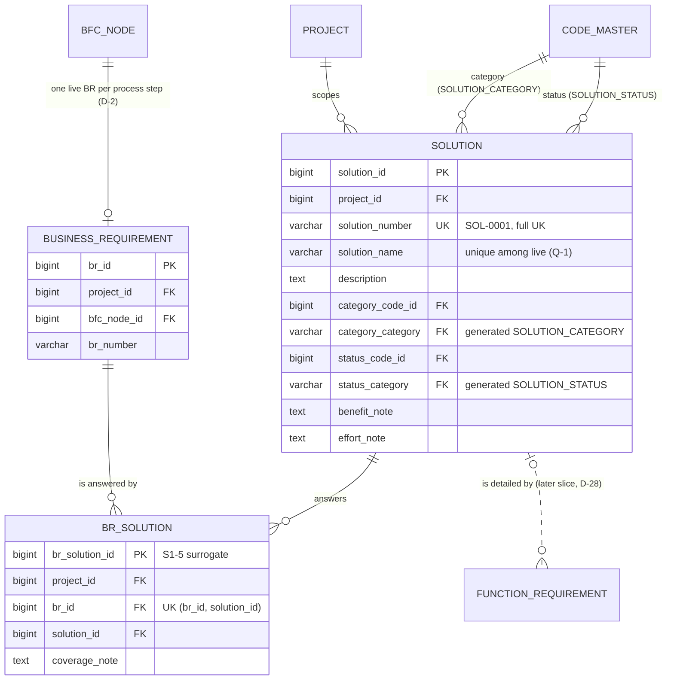

# Slice 5 — Solutions and BR→Solution links: physical schema spec

Author: `apple` · 2026-10-09 · source of truth: `docs/VB_design.md` (signed off 2026-09-28), with
the §1a review rows winning over older text. This spec **does not redesign**. Where the design is
silent or ambiguous once it is made physical, the spec shows a **proposed** choice marked
**[Q-n]**, and §6 lists each one for Ben. Nothing marked [Q-n] should be built until Ben has
answered it.

Scope: `solution` (§6.1 row 19) and `br_solution` (row 20); §4.3 `link_br_solution`, §4.4
`create_solution`, §5.2/§5.3 SOLUTION and BR_SOLUTION, §5.4.15, §6.2, §6.3, §7.5.
Dialect: **PostgreSQL 16**. The conventions are the ones Slices 1–4 built:
- a surrogate identity PK;
- `(id, project_id)` composite FKs onto a `uq_<t>_project` UK;
- every code FK has a generated category column (`vb_ops.category_column`) and an FK to
  `uq_code_category_target` (S1-4);
- `AuditMixin` / `vb_ops.audit_columns()`, plus `updated_at_trigger()`;
- every FK is `NO ACTION`, and partial or expression indexes go in raw `op.execute`.

---

## 1. `solution` — one row per transformation answer within one project (D-7)

| Column | Type | Null | Default | FK | Description |
|---|---|---|---|---|---|
| `solution_id` | bigint identity | NO | identity | — | PK |
| `project_id` | bigint | NO | — | → `project` | tenancy. From the route, never the body |
| `solution_number` | varchar(20) | NO | — | — | `SOL-0001`, minted at save by `numbering.next_number(…, "SOL")` (law 6). Never reused |
| `solution_name` | varchar(200) | NO | — | — | the length matches `de_name` |
| `description` | text | YES | — | — | |
| `category_code_id` | bigint | NO | — | category FK | `SOLUTION_CATEGORY`: ORG_AND_RULES / PEOPLE / PROCESS / DATA / TECHNOLOGY |
| `category_category` | varchar(40) | NO* | **GENERATED `'SOLUTION_CATEGORY'` STORED** | category FK | S1-4. The name follows the `<prefix>_category` rule **[Q-6]** |
| `status_code_id` | bigint | NO | — | category FK | `SOLUTION_STATUS`. Set to PROPOSED by the service on create **[Q-4]** |
| `status_category` | varchar(40) | NO* | **GENERATED `'SOLUTION_STATUS'` STORED** | category FK | S1-4 |
| `benefit_note` | text | YES | — | — | free text. Quantified benefits are `BENEFIT` (D-14), later |
| `effort_note` | text | YES | — | — | free text. Priced effort is derived on the FR (D-13), never here |
| + `AuditMixin` | | | | | `created_*`, `updated_*`, `is_active`, `deleted_*`, `row_version` (law 3) |

\* never NULL, because it is a stored constant.

**Keys and FKs** (all `NO ACTION`)
- PK `solution_id`.
- UK `uq_solution_number (project_id, solution_number)`. This is **full**: a minted number is
  never reused (S1-6, §6.2 "uniqueness comes from the constraint").
- UK `uq_solution_project (solution_id, project_id)`. This is the composite target for
  `br_solution`. Later it also serves `function_requirement`, `application_solution`,
  `benefit_solution`, `solution_phase`, `solution_dependency`, `wbs_item`, `risk` and
  `cr_impact`.
- Partial UK `uq_solution_name_live ON solution (project_id, lower(btrim(solution_name))) WHERE is_active` **[Q-1]**.
- `project_id → project(project_id)`. Unnamed, as on every table.
- `fk_sol_category_code (category_code_id, category_category) → code_master(code_id, category) ON UPDATE NO ACTION`.
- `fk_sol_status_code (status_code_id, status_category) → code_master(code_id, category) ON UPDATE NO ACTION`.

**CHECKs**
- *apple addition:* `ck_sol_name_not_blank (btrim(solution_name) <> '')`. The service trims the
  name before saving, so a blank name gets a 422 rather than reaching this CHECK.

**Indexes**
- `ix_sol_category (category_code_id)` and `ix_sol_status (status_code_id)`. These follow §6.3's
  "every FK gets an index", like `ix_br_status`.
- `uq_solution_number` (leading `project_id`) serves the project list, the project FK and
  `purge_project`. No separate `project_id` index is needed.

**Model:** `Solution(AuditMixin, Base)` in a new `models/solution.py`, exported from
`models/__init__.py` (law 10). It follows the `BusinessRequirement` shape:
- `category_code_row` / `status_code_row` are view-only relationships, with `category_code` /
  `status_code` properties;
- `owning_project_id()` lets routes use `object_guard(Solution, …)`.

---

## 2. `br_solution` — one row per (BR × solution) pairing (D-7)

| Column | Type | Null | Default | FK | Description |
|---|---|---|---|---|---|
| `br_solution_id` | bigint identity | NO | identity | — | PK (S1-5 surrogate) **[Q-2]** |
| `project_id` | bigint | NO | — | → `project`, and in both composites | copied from the BR by the service |
| `br_id` | bigint | NO | — | composite | |
| `solution_id` | bigint | NO | — | composite | |
| `coverage_note` | text | YES | — | — | "answers only the approval half of BR-0042" |
| + `AuditMixin` | | | | | |

**Keys and FKs** (all `NO ACTION`)
- PK `br_solution_id`.
- UK `uq_brsol_grain (br_id, solution_id)`, **full, not partial**. This is the design's PK `(br_id, solution_id)`, kept as a `UNIQUE NOT NULL` key (S1-5).
- `fk_brsol_br (br_id, project_id) → business_requirement(br_id, project_id)` targets `uq_br_project`.
- `fk_brsol_solution (solution_id, project_id) → solution(solution_id, project_id)` targets `uq_solution_project`.
- `project_id → project(project_id)`.
- Together, the two composites make a cross-project pairing **impossible in the database** (§6.2, "all junctions").

**Why the surrogate PK and the full UK.** This matches `br_data_entity` and `br_org_role`
exactly:
- **The shadow needs a single key.** `baseline_shadow.shadow_table()` records the live PK as one
  `source_id bigint`, and a composite PK has no single value to record. This reason alone forces
  the surrogate (S1-5).
- **Re-linking restores the old row.** `lifecycle.unlink` soft-deletes the pair. Linking the same
  pair again finds the dead row through the full UK and calls `lifecycle.relink`, which restores
  that row (S1-7, `business_requirement.link_data_entity`). The pair therefore keeps one id
  across unlink and relink, and a baseline diff sees the same `source_id`.
- **The UK must be full.** A partial UK would let a second row for the same pair accumulate.

**No CHECKs, and no process guard.** The BR already carries the D-23 guard. This table adds no
row-local rule.

**Indexes**
- `uq_brsol_grain` (leading `br_id`) serves `fk_brsol_br` and "solutions answering this BR".
- `ix_brsol_solution (solution_id, project_id)` serves the reverse FK, "BRs this solution
  answers", the `solution_matrix` join, and the FK_LIVENESS scan when a solution is retired.
- `ix_brsol_project (project_id)` follows the sibling junctions; it serves the coverage reports
  and `purge_project`.

**Model:** `BrSolution(AuditMixin, Base)` in `models/solution.py`, exported from `__init__`.
`owning_project_id()` returns `project_id`.

**Service contract for `link_br_solution` (§4.3)** *(revised after design review round 1)*
- **First, before any lock, liveness check or label:** fetch the solution with
  `solution_id = :id AND project_id = br.project_id`. Missing, in another project, or invisible
  → **404**, with nothing from the other project in the body (DR1-S1). The sibling's
  `step_io.live_entity` pattern (plain `db.get`) is **not** copied.
- Lock the BR's step, then the BR, with `lock_for_share`; then **`lock_for_share` the solution
  and only then check it is live** (DR1-D1). All three must be live, otherwise 409 "Restore it
  first". This is the SR-5 order, so a link, a step retire and a solution retire are serialised.
- Find the row by `(br_id, solution_id)` and **lock it FOR UPDATE** (`lifecycle.lock`) before
  choosing a branch (DR1-P4):
  - none: insert it (a concurrent insert loses on the full UK → the generic 409);
  - live: 409 "already linked";
  - dead: `relink(..., detail={"previous_coverage_note": old})` (DR1-D2), and set
    `coverage_note` to the value sent.
- Unlinking is `lifecycle.unlink(row, row_version)`.
- The §7.5 D-34 hook ("clear `suggested_br_id` on the solution's FRs, same transaction") has
  nothing to act on until `function_requirement` exists **[Q-7]**.

---

## 3. Retire and restore

| Case | Behaviour | Verdict |
|---|---|---|
| **Retire a step whose BR has live `br_solution` rows** | Recommend **`BrSolution` joins `OWNED_BY_BR`**. The pairing then retires and restores with its BR, inside the one step-retire action **[Q-3]** | see below |
| Retire a **solution** with live `br_solution` rows | `lifecycle.retire` → **409**, naming the pairings. `LINKS` derives this from `fk_brsol_solution`, so there is no code to write | **Correct.** It is Q4 / §5.4.15 row `br_solution`, and nothing cascades (law 1). A solution is an independent object that answers many BRs, so retiring it is a scope decision the consultant makes pairing by pairing. Later, live FRs, applications, benefits and phases block it the same way |
| Retire a **BR** on its own (plain route) with live pairings | 409 via `fk_brsol_br` | Same as `br_org_role` today |
| Restore a solution | Add `Solution` to `lifecycle.RESTORABLE`. Code parents are excluded, so the only refusal is a name clash: the service pre-checks `uq_solution_name_live` and returns 409, never a raw unique violation **[Q-1]** | — |
| Restore a pairing | Through relink only. `BrSolution` is not in `RESTORABLE`, as for the sibling junctions | — |

**Why `OWNED_BY_BR` and not a blocker.**
- **The pairing exists only because of the BR.** It is a fact about that requirement ("BR-0042 is
  answered by SOL-0003"), the same kind of row as `br_org_role`, which S3-SR already owns. The
  *solution* is not owned and survives.
- **Blocking would bring back the friction S3-SR removed.** The consultant would have to unlink
  every answer by hand before retiring a step, and the undo would not bring the pairings back.
- **Nothing is lost.** A solution whose last BR goes shows up as `solution_without_br` (§7.9), and
  the preview lists each pairing, so the consultant sees it before confirming.
- **Restore stays all-or-nothing (A-SR-5).** If the solution was retired in the meantime,
  `inactive_parents` makes restore refuse with "Restore these first: Solution SOL-0003".

**Code changes in `step_retire.py`**
- `OWNED_BY_BR = (BrDataEntity, BrOrgRole, BrSolution)`.
- `BrSolution` goes in tier 2, beside `BrOrgRole`. It has no licence FK, so any tier before
  `BusinessRequirement` works.
- `describe()` renders it as `BR-0042 ↔ SOL-0003 <name>`.
- `lifecycle.LABELS` gains `solution` → ("Solution", `f"{solution_number} {solution_name}"`) and
  `br_solution` → ("Requirement ↔ solution", `"BR-0042 ↔ SOL-0003"`, both ends read through the row), so a solution-retire 409 names the BRs (DR1-P1).
- A-SR-1 requires an explicit test: criteria 1 and 5 run with a pairing in the owned set.

If Ben declines Q-3, nothing is written: the FK makes a live pairing a step-retire **blocker**
by default (SR-4).

---

## 4. Baseline

- Both tables are in the frozen set (§6.1 rows 19–20). **Nothing is hand-written here.**
  `baseline_solution` and `baseline_br_solution` are generated by
  `services/baseline_shadow.shadow_table()` when the freeze slice builds `baseline`. That table
  does not exist yet, so this slice creates no shadow, no reject trigger and no parity entry.
- What the shadow will contain:
  - the PK becomes `source_id`;
  - the audit columns and generated columns (`category_category`, `status_category`) are
    dropped;
  - `parity_problems()` will catch any later column drift.
- The surrogate PK (Q-2) is what makes `baseline_br_solution` generate cleanly.

---

## 5. ER fragment

---

## 6. Questions for Ben (recommendation first)

1. **Is `solution_name` unique among live solutions in a project?** The design is silent.
   **Rec: yes.** Use a partial `uq_solution_name_live (project_id, lower(btrim(solution_name))) WHERE is_active`, project-wide and not per category.
   - The S1-6 rule ("user-entered names unique among live rows") covers every other named object.
   - Two live solutions with one name make `solution_matrix` and client documents ambiguous.
   - A retired name frees up.
   - Restore pre-checks the clash and returns 409.
2. **`br_solution` PK.** §5.2/§5.3 say PK `(br_id, solution_id)`. **Rec: a surrogate
   `br_solution_id` plus a full UK on the pair**, with the same wording S1-5 gave the four
   existing junctions. The baseline shadow cannot record a composite PK as `source_id`, and
   relink needs the full UK. Ask Ben to extend S1-5 to **every** junction, so that the
   application, benefit, phase and dependency slices do not each re-ask.
3. **Step retire.** **Rec: `BrSolution` joins `OWNED_BY_BR`** (§3). This edits the S3-SR owned
   set, so it is Ben's call (A-SR-1). The alternative, keeping it as a blocker, needs no code.
4. **Initial status.** The `create_solution` pseudocode (§7.5) never sets `status_code_id`, yet
   the column is NOT NULL. **Rec: the service sets SOLUTION_STATUS/PROPOSED**, the way BR gets
   DRAFT. The create body takes no status, and status changes through update. No code branches on
   a status value, because SOLUTION_STATUS is project-editable (`is_system = False`).
5. **SOLUTION_CATEGORY is project-editable, yet code branches on its codes.**
   - Several places read the category codes directly:
     - `create_fr` (§7.5) tests `category_code in ('TECHNOLOGY','DATA')`;
     - coverage has `tech_solution_no_fr` and `solution_no_application`;
     - `solution_matrix` and `process_change_intensity` pivot on the five codes.
   - The seed has `is_system = False`, so a project could rename or retire TECHNOLOGY and silently
     break these (the law 5 class).
   - D-7 fixes the set at five.
   - **Rec: seed SOLUTION_CATEGORY with `is_system = True`** (a seed change, not a schema change),
     so the codes are stable and branching on them is safe.
   - The alternative is a `behaviour_code` as for FR_TYPE/RACI. It would change the `code_master`
     CHECKs and is heavier than the five-fixed-values case needs.
6. **Generated column name.** The house rule `<prefix>_code_id → <prefix>_category` gives
   `category_category`. **Rec: keep it.** It is mechanical, and consistent with `status_category`.
   The alternative renames the FK to `solution_category_code_id`, which departs from the design's
   column name. Say if you prefer it.
7. **The D-34 hook on `link_br_solution`.** §4.3/§7.5 clear `suggested_br_id` "in the same
   transaction", and `function_requirement` does not exist yet. **Rec:** build the link without
   it now. The FR slice adds the UPDATE to `link_br_solution`, with its test.
8. **§5.4.15 says "codes" are liveness-checked on `solution`.** `lifecycle.EXCLUDED_TARGETS`
   excludes `code_master`, and codes retire through `code_master.maintain` (R2-D8). **Rec:**
   follow the code, as every built table does. Amend §5.4.15's "codes" wording once, for all
   tables.
9. **`benefit_note` / `effort_note` beside D-13/D-14.** Both are in §5.2. **Rec: keep them as
   free text.** Never parse them or roll them up; quantified benefit and priced effort live on
   `BENEFIT` and on the FR.
10. **Naming collision (minor).** The `baseline_shadow.py` docstring says "Slice 5 calls
    `shadow_table()`", meaning the freeze slice. **Rec:** reword it to "the freeze slice" when
    this lands.

## 7. Migration plan (one per commit, reversible, on `main`, in order)

The head is **0020** (`import_row`). Coordinate on `main` before creating either revision.

| Rev | Creates | Depends on |
|---|---|---|
| 0021 | `solution` with `audit_columns()`, the UKs, the two code FKs, `ck_sol_name_not_blank`, raw `uq_solution_name_live` and `trg_solution_updated_at` | `project`, `code_master` (`uq_code_category_target`) |
| 0022 | `br_solution` with `audit_columns()`, `uq_brsol_grain`, both composite FKs, the two indexes and the trigger | `business_requirement` (`uq_br_project`), `solution` (`uq_solution_project`) |

Each downgrade drops the trigger, then the table. Neither migration is destructive on upgrade,
and neither touches seeds: both categories are seeded. Q-5 would be a seed edit. `sara`
reviews before commit, because the retire set changes.
